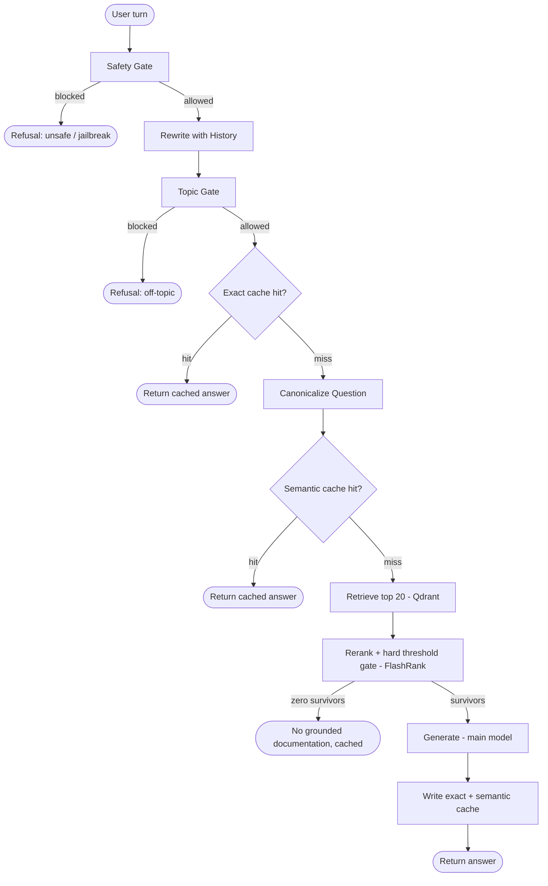

# Kubernetes Agentic RAG

A retrieval-augmented Q&A system for Kubernetes questions, built to run entirely on a no-GPU, 16GB laptop by offloading every model-weight operation to free-tier hosted APIs. Local compute is limited to parsing, chunking, and CPU/ONNX reranking.

Not a scale project, a demonstration of the pieces that separate a "wrap an LLM around a vector search" demo from something closer to production shape: two-layer caching with intent preservation, structure-aware chunking that respects Kubernetes manifest boundaries, a hard-gated reranker instead of similarity-only retrieval, provider failover, and full request tracing.

<p align="center">
  
</p>

> **Note:** `docs/screenshot.png` is a placeholder path, not a bundled image. Drop in a real screenshot of your own running app (light theme, an example Q&A, "Show pipeline trace" toggled on in the sidebar so the trace bar is visible) at that path before this renders on GitHub.

## Contents

- [Architecture](#architecture)
- [Tech stack](#tech-stack)
- [Provider roles](#provider-roles)
- [Setup](#setup)
- [Configuration: the two threshold knobs](#configuration-the-two-threshold-knobs)
- [Project structure](#project-structure)
- [Testing](#testing)
- [Evaluation](#evaluation)
- [Intentionally simplified](#intentionally-simplified)
- [Known limitations](#known-limitations)

## Architecture



- **Safety Gate** runs on the raw message, before any other LLM call, so a jailbreak attempt is rejected before it costs a planner call. Two independent checks, either firing blocks the message: a NeMo Guardrails (Colang) few-shot flow for jailbreak-*pattern* detection, and a direct LLM classifier for broader unsafe-*content* categories (violence, harassment, etc.) that don't necessarily look like a jailbreak attempt.
- **Topic Gate** runs on the rewritten standalone question, so context-dependent follow-ups aren't misjudged as off-topic in isolation. A direct LLM classifier, not few-shot flow matching, on purpose, "is this on-topic for Kubernetes" is an open-ended classification over an unbounded space of possible off-topic requests, not a small set of recognizable patterns a few-shot example list can cover.
- Both gates **fail closed**: a classifier error, or an unparseable classifier response, blocks the request rather than letting it through. Verdict parsing checks only the model's first token against the expected word, not "does this word appear anywhere in the response", which would misfire on a model adding any explanation around its answer.
- **Exact cache** and **semantic cache** are two independent layers: exact match is cheap with zero false-positive risk but only catches identical questions; semantic cache catches paraphrases but relies on the canonicalization step to preserve intent (e.g. "create" vs "destroy") before the embedding similarity check runs.
- **Rerank + gate** is two distinct operations: FlashRank reorders candidates by relevance, then a hard score threshold drops anything below it entirely, reordering alone doesn't filter noise out of what reaches the generator.
- **No-context outcomes are cached too** (exact-match layer, short TTL), so a repeated question with no matching documentation doesn't re-pay retrieval and reranking every time, while still expiring if the corpus is later updated.
- **Ingestion has its own relevance gate**, separate from the query-time guardrails: `ingest.py` classifies each document's excerpt before chunking and embedding it, and skips anything off-topic to the corpus rather than embedding it and hoping retrieval never surfaces it. Unlike `safety_gate`/`topic_gate`, this fails **open** on a classifier error, a missed rejection just leaves one extra document the rerank gate will likely filter per-query anyway; a false rejection silently shrinks a batch ingestion job with nobody watching to notice.

Implemented as a LangGraph state machine (`src/graph.py`), not a linear script, every node is independently callable and independently testable.

## Tech stack

- **Orchestration:** LangGraph
- **LLMs:** NVIDIA NIM (primary), Groq (fallback)
- **Guardrails:** NeMo Guardrails / Colang (jailbreak-pattern detection) + a direct LLM classifier (topic control & unsafe-content detection)
- **Embeddings:** Google Gemini (`gemini-embedding-001`), batched per ingested file
- **Vector database:** Qdrant
- **Reranking:** FlashRank (cross-encoder)
- **Caching:** SQLite (exact cache), Qdrant (semantic cache)
- **Document processing:** BeautifulSoup4, PyMuPDF, python-docx, python-pptx, Markdown parsing, Kubernetes-manifest-aware chunking
- **Evaluation:** RAGAS
- **Tracing & observability:** Logfire
- **Frontend:** Streamlit
- **Testing:** pytest

## Provider roles

| Role | Primary | Fallback | Why |
|---|---|---|---|
| Main generation | NVIDIA NIM | Groq | retry-then-failover on transient errors only; NIM's RPM-only free tier suits a chatty pipeline better than Groq's tight TPM cap, Groq catches NIM outages |
| Planner (rewrite, canonicalize, topic/safety classification) | NIM, small model | Groq, small model | kept off the main generation model's rate budget entirely |
| Jailbreak detection | NeMo Guardrails / Colang, backed by Groq | none, fails closed | few-shot pattern matching suits jailbreak-shaped attempts specifically; not used for general topic/safety classification, which generalizes poorly under a fixed few-shot example set |
| Embeddings | Google Gemini, `gemini-embedding-001`, truncated to 768 dims | none | GA, free tier, 768 dims keeps Qdrant storage well under free-tier limits |
| Eval judge | Groq | — | deliberately separate from whatever's serving live traffic |

Exact model IDs live in `.env.example` / `src/config.py`, not hardcoded in the pipeline logic. Only transient errors (timeouts, rate limits, connection errors, 5xx) trigger retry-then-failover; non-transient client errors (bad request, auth) propagate immediately rather than wasting a retry and a failover on something that will never succeed.

## Setup

```bash
python3 -m venv venv && source venv/bin/activate   # Windows: venv\Scripts\activate
pip install -r requirements.txt
cp .env.example .env   # fill in NVIDIA_NIM_API_KEY, GROQ_API_KEY, GEMINI_API_KEY, QDRANT_URL, QDRANT_API_KEY

pytest tests/ -v

python ingest.py DATA --wipe

streamlit run ui/app.py
```

`DATA/` follows a `true_data/` (the real corpus) and `noisy_data/` (off-topic content, expected to be rejected by the ingestion relevance gate, not a lower-trust second tier) convention rather than a curated official/community split, both directories are run through the same `ingest_directory()` path in `ingest.py`. Bring your own `DATA/true_data/` and `DATA/noisy_data/`, there's no bundled starter corpus or fetch script in this project, that's a deliberate choice: any doc-fetching tool needs to be run by you, against sources you've checked, not shipped as something that silently pulls third-party content on your behalf.

## Configuration: the two threshold knobs

Both live in `.env`, both need empirical tuning against your own corpus and query patterns, there's no universally correct value.

**`SEMANTIC_CACHE_SIMILARITY_THRESHOLD`** (default `0.95`), cosine similarity floor for a semantic cache hit.
- Too loose: unrelated questions return a stale cached answer.
- Too tight: genuine paraphrases ("what is X" vs "tell me about X") miss the cache and pay full generation cost every time. If you see this, check `canonicalize_question`'s output first, the canonicalizer is supposed to converge same-intent phrasings onto near-identical text before the embedding check ever runs. Lowering the threshold is the second lever, not the first.

**`RERANK_SCORE_THRESHOLD`** (default `0.5`), FlashRank cross-encoder score floor; anything below is dropped, not just deprioritized.
- Too loose: noisy, weakly-related chunks reach the generator and it hallucinates around them.
- Too tight: everything gets dropped and the system claims it has no documentation when it does. Cross-encoder scores are **not calibrated probabilities**, don't assume 0.5 means "50% confident." Before trusting any value, print the actual score distribution for a few real queries against your corpus (a quick REPL call to `src.rerank._get_ranker().rerank(...)` on a handful of retrieved candidates) and set the threshold relative to what you actually see, not the default.

There's also **`NO_CONTEXT_CACHE_TTL_SECONDS`** (default `3600`), how long a cached "no grounded documentation" answer is trusted before the next identical question re-checks retrieval, lower it if you're actively adding to the corpus and don't want a stale no-context verdict to outlive a re-ingest.

## Project structure

```
kubernetes-agentic-rag/
│
├── .streamlit/
│   └── config.toml                       # theme, toolbar mode
├── ui/
│   └── app.py                            # Streamlit chat UI (rerun-safe via st.chat_input)
├── ingest.py                             # CLI pipeline: parse → relevance-gate → chunk → embed → upsert
│
├── src/                                  # Core RAG pipeline
│   ├── config.py                         # application settings, retrieval/rerank thresholds
│   ├── clients.py                        # NIM, Groq, Gemini & Qdrant client singletons with timeouts
│   ├── llm.py                            # retry-then-failover LLM wrapper (transient errors only)
│   ├── embeddings.py                     # Gemini embedding generation, batched, rate-limit-aware retry
│   ├── guardrails.py                     # safety_gate() & topic_gate() (fail-closed, hybrid Colang + classifier)
│   ├── colang_rules.py                   # Colang jailbreak-flow definitions for the safety gate
│   ├── ingest_filter.py                  # ingestion-time document relevance classifier (fails open)
│   ├── cache.py                          # exact-match and semantic caching layers
│   ├── parsers.py                        # PDF, HTML, TXT, DOCX, PPTX & YAML text extraction
│   ├── chunking.py                       # markdown-header & Kubernetes-manifest-aware chunking
│   ├── retrieval.py                      # Qdrant dense vector retrieval
│   ├── rerank.py                         # FlashRank reranking + hard relevance threshold, lazy-loaded
│   ├── graph.py                          # LangGraph orchestration/state machine
│   └── tracing.py                        # Logfire tracing and observability
│
├── DATA/
│   ├── true_data/                        # the real corpus, bring your own
│   └── noisy_data/                       # off-topic content the ingestion gate should reject
│
├── eval/
│   ├── eval_set.json                     # starter evaluation dataset
│   ├── dataset.py                        # eval set loader/validator
│   └── run_eval.py                       # RAGAS evaluation (6 retrieval & generation metrics)
│
├── tests/
│
├── .env.example                          # API keys for NIM, Groq, Gemini & Qdrant
├── .gitignore
├── requirements.txt                      # project dependencies
└── README.md                             # architecture, ingestion flow, setup, evaluation guide
```

## Testing

```bash
pytest tests/ -v
```

Every provider call is mocked, the suite runs with no real API keys and no network beyond `pip install`. `tests/test_chunking.py` runs against zero external dependencies and is worth reading first if you want to see the manifest-block-boundary logic actually exercised: the chunker uses `apiVersion:` at column zero as an object's start marker and `---` as the document separator, so tests should cover multi-document files, a document with no trailing separator, and prose sections that don't parse as manifests at all (falls back to a sliding window).

## Evaluation

```bash
python eval/run_eval.py
```

Runs RAGAS's six metrics (faithfulness, answer relevancy, context precision/recall, context entity recall, semantic similarity) against `eval/eval_set.json`, judged by a model deliberately separate from whatever's serving live chat traffic. The included eval set is 8 hand-built pairs grounded in the shipped synthetic corpus, enough to confirm the eval path actually runs end-to-end, not a real benchmark. Extend it with real Q&A pairs before drawing conclusions from the scores.

## Intentionally simplified

- **The safety/topic classifiers use plain single-word-verdict prompts**, not NVIDIA NeMoGuard's purpose-built, separately-tuned classification models. Functionally reasonable and fail-closed, but a purpose-built safety model will generally out-calibrate a general-purpose LLM told to output one word, this is the most likely place classification quality is being left on the table.
- **Jailbreak detection is few-shot pattern matching** (Colang), not a dedicated jailbreak-classification model either. It catches attempts that resemble the examples in `colang_rules.py`; genuinely novel jailbreak phrasing may not match closely enough to trigger the flow. Extend by adding more diverse examples if you find a gap.
- **No bundled corpus.** Bring your own `DATA/true_data/` and `DATA/noisy_data/`. The eval set (`eval/eval_set.json`) is synthetic, written for this project rather than scraped, for copyright reasons, extend it with a real hand-built set before treating its scores as representative.

## Known limitations

- FlashRank's cross-encoder score is not a calibrated probability, see the threshold section above.
- The manifest chunker is a structural heuristic, not a real YAML parser: a block scalar (`|` or `>`) whose literal content happens to contain a line that is exactly `---` will be mis-split as if it were a document boundary. Rare in practice for real Kubernetes manifests, but worth knowing rather than assuming full YAML awareness.
- No conversation persistence, history lives in `st.session_state` and is lost on page reload. The exact/semantic caches persist independently of chat history, so repeated questions across sessions still benefit from caching even though the visible transcript doesn't.
- Single-user local demo, not multi-tenant. The exact cache is a local SQLite file (`.cache/exact`); the semantic cache lives in Qdrant and is shared across every session hitting the same Qdrant collection.
