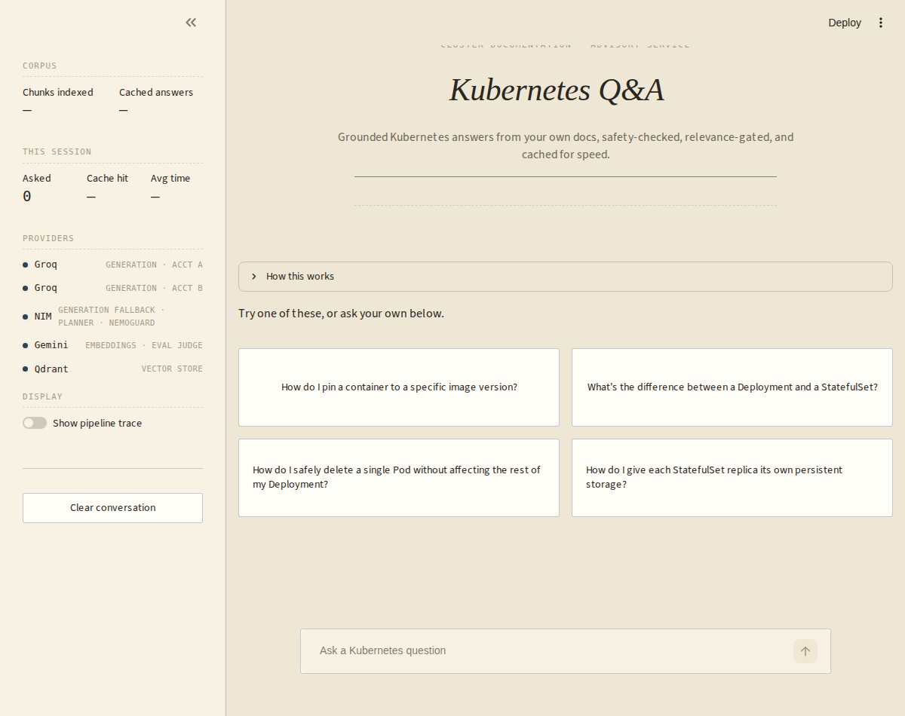
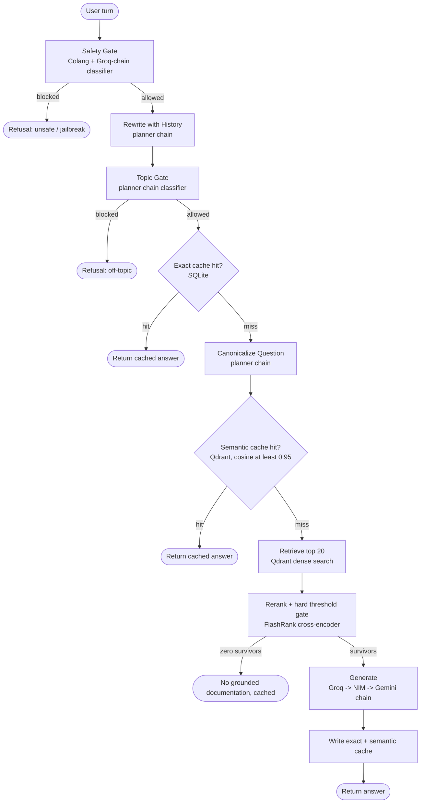

# Kubernetes Gated RAG

A retrieval-augmented Q&A system for Kubernetes questions, gated at every stage rather than trusting any single check: a safety gate and topic gate before a message is even processed, a hard relevance threshold that drops weak retrieval matches instead of just reordering them, and fail-closed behavior throughout, a classifier error blocks a request rather than letting it through. Built to run entirely on a no-GPU, 16GB laptop by offloading every model-weight operation to free-tier hosted APIs; local compute is limited to parsing, chunking, and CPU/ONNX reranking.

Not a scale project, a demonstration of the pieces that separate a "wrap an LLM around a vector search" demo from something closer to production shape: two-layer caching with intent preservation, structure-aware chunking that respects Kubernetes manifest boundaries, a hard-gated reranker instead of similarity-only retrieval, three-way provider failover, and full request tracing.

## Preview

<p align="center">
  
  <br>
  <sub><em>Landing view, with the pipeline's own architecture collapsed under "How this works".</em></sub>
</p>

> Additional screenshots (`ui_landing_full.png`, `cache_hit.png`, `example_search.png`) are in [`assets/`](assets/) using that naming convention, for different stages/scenarios of pipeline.

## What this is

Given a message, the system:

1. Runs it through independent safety and topic gates before anything else happens, both fail closed on any classifier error.
2. Checks an exact-match cache, then, after canonicalizing the question, a semantic-match cache, returning immediately on either hit.
3. On a miss, retrieves candidates from Qdrant and reranks them with a cross-encoder, hard-dropping anything under a relevance threshold rather than just deprioritizing it.
4. Generates an answer strictly from what survived reranking, or returns a cached "no grounded documentation" response if nothing did.
5. Writes the answer back to both cache layers, so repeat and paraphrased questions never re-pay the same retrieval and generation cost.

Implemented as a LangGraph state machine, not a linear script, every node is independently callable and independently testable. Every provider call fails over across three independent vendors (Groq → NIM → Gemini) on transient errors only, traces every node and provider call (Logfire), is exposed as a Streamlit UI, and ships with a RAGAS-based evaluation harness.

## Architecture



- **Safety Gate** runs on the raw message, before any other LLM call, so a jailbreak attempt is rejected before it costs a planner call. Two independent checks run concurrently, either firing blocks the message: a NeMo Guardrails (Colang) few-shot flow for jailbreak-*pattern* detection, and a direct LLM classifier, with few-shot calibration examples, for broader unsafe-*content* categories (violence, harassment, prompt-injection attempts that don't match a known jailbreak template) that don't necessarily look like a jailbreak attempt.
- **Topic Gate** runs on the rewritten standalone question, so context-dependent follow-ups aren't misjudged as off-topic in isolation. A direct LLM classifier, not few-shot flow matching, on purpose, "is this on-topic for Kubernetes" is an open-ended classification over an unbounded space of possible off-topic requests, not a small set of recognizable patterns a few-shot example list can cover.
- Both gates **fail closed**: a classifier error, or an unparseable classifier response, blocks the request rather than letting it through. Verdict parsing checks only the model's first token against the expected word, not "does this word appear anywhere in the response", which would misfire on a model adding any explanation around its answer.
- **Exact cache** and **semantic cache** are two independent layers: exact match is cheap with zero false-positive risk but only catches identical questions; semantic cache catches paraphrases but relies on the canonicalization step to preserve intent (e.g. "create" vs "destroy") before the embedding similarity check runs. The canonical question is embedded once per turn and the vector is reused for both the lookup and, on a miss, the write, not re-embedded twice for the same text.
- **Rerank + gate** is two distinct operations: FlashRank reorders candidates by relevance, then a hard score threshold drops anything below it entirely, reordering alone doesn't filter noise out of what reaches the generator.
- **No-context outcomes are cached too** (exact-match layer, short TTL), so a repeated question with no matching documentation doesn't re-pay retrieval and reranking every time, while still expiring if the corpus is later updated.
- **Ingestion has its own relevance gate**, separate from the query-time guardrails: `ingest.py` classifies each document's excerpt before chunking and embedding it, and skips anything off-topic to the corpus rather than embedding it and hoping retrieval never surfaces it. Unlike `safety_gate`/`topic_gate`, this fails **open** on a classifier error, a missed rejection just leaves one extra document the rerank gate will likely filter per-query anyway; a false rejection silently shrinks a batch ingestion job with nobody watching to notice.

## Models

Four independent providers across the generation and planning chains, so a single vendor's outage or rate limit doesn't take the whole app down:

| Role | Model | Provider(s) | Notes |
|---|---|---|---|
| Main generation | `openai/gpt-oss-120b` (Groq, NIM), `gemini-2.5-flash` (Gemini) | Groq &rarr; NVIDIA NIM &rarr; Google Gemini | retry-then-failover per link, transient errors only; Groq's low latency suits a chat UI best, NIM catches Groq's tighter TPM cap, Gemini is a last-resort third provider |
| Planner (rewrite, canonicalize, topic/safety classification) | `openai/gpt-oss-20b` (Groq), `meta/llama-3.1-8b-instruct` (NIM), `gemini-2.5-flash-lite` (Gemini) | same chain and reasoning as main generation | kept off the main generation model's rate budget entirely |
| Jailbreak detection | Colang few-shot flow | Groq-backed, no fallback (fails closed) | pattern matching suits jailbreak-shaped attempts specifically; not used for general topic/safety classification, which generalizes poorly under a fixed few-shot example set |
| Embeddings | `gemini-embedding-001`, truncated to 768 dims | Google Gemini, no fallback | GA, free tier, 768 dims keeps Qdrant storage well under free-tier limits |
| Eval judge | `openai/gpt-oss-120b` | Groq only | deliberately separate from whatever's serving live traffic |

Exact model IDs live in `.env.example` / `src/config.py`, not hardcoded in the pipeline logic. Only transient errors (timeouts, rate limits, connection errors, 5xx) trigger retry-then-failover to the next link in the chain; non-transient client errors (bad request, auth) propagate immediately rather than wasting a retry and a failover on something that will never succeed. Each OpenAI-compatible client (Groq, NIM) has a 15s request timeout, so a single unresponsive provider costs at most ~30s (one retry) before the chain moves to the next, rather than ~60s.

## Guardrails

- **Fail-closed gates**: both the Safety and Topic gates block on any classifier error or unparseable verdict rather than letting the request through, the opposite default from the ingestion gate below.
- **Two independent safety checks, dispatched concurrently**: a Colang few-shot flow for jailbreak-*pattern* detection, and a direct LLM classifier for broader unsafe-content categories, either firing is enough to block; concurrent dispatch means the gate's latency is bounded by the slower of the two, not their sum.
- **Hard rerank threshold, not just reordering**: FlashRank reorders candidates by relevance, then anything below the score threshold is dropped entirely, not merely deprioritized.
- **Ingestion has its own, separately-tuned gate that fails open**: the opposite default from the query-time gates, deliberately, a missed rejection at ingest time is cheap (the rerank gate likely filters it per-query anyway), but a false rejection silently shrinks a batch ingestion job with nobody watching to notice.
- **Provider timeouts**: 15s per OpenAI-compatible client call, so a single unresponsive provider in the chain costs at most ~30s (one retry) before the request moves to the next provider.

## Caching

Two independent layers, checked in order, both scoped per Qdrant collection rather than per user:

- **Exact match** → the standalone question, normalized, hits SQLite directly. Zero false-positive risk, but only catches identical questions.
- **Semantic match, cosine ≥ `SEMANTIC_CACHE_SIMILARITY_THRESHOLD`** → the canonicalized question's embedding is checked against Qdrant. Catches paraphrases, but only as well as the canonicalization step preserves intent first, `"create X"` and `"destroy X"` must never converge onto the same canonical text.
- **No match** → full retrieval, rerank, and generation, followed by a write to both layers.

A confirmed "no grounded documentation" outcome is cached too, under a short TTL (`NO_CONTEXT_CACHE_TTL_SECONDS`), so a repeated unanswerable question doesn't re-pay retrieval every time, while still expiring on its own if the corpus is later updated.

## Safety

Retrieved context here comes only from your own ingested, gate-filtered corpus, not the open web, so the classic prompt-injection-via-search-results surface doesn't apply the same way it would to an agent that fetches live pages. The actual trust boundary is narrower and more direct: whatever safety or topic risk exists depends entirely on what you choose to ingest into `data/`, the query-time guardrails exist to filter what users can *ask*, not to sanitize what the corpus itself contains.

## Project structure

```
kubernetes-gated-rag/
├── .streamlit/config.toml                # theme, toolbar mode
├── ui/app.py                             # Streamlit chat UI (rerun-safe via st.chat_input)
│
├── src/                                  # Core RAG pipeline
│   ├── config.py                         # application settings, retrieval/rerank thresholds
│   ├── tracing.py                        # Logfire tracing and observability
│   ├── graph.py                          # LangGraph orchestration/state machine, ties every package below together
│   │
│   ├── providers/                        # model-provider plumbing, no RAG-specific logic
│   │   ├── clients.py                    # NIM, Groq, Gemini & Qdrant client singletons with timeouts
│   │   └── llm.py                        # Groq -> NIM -> Gemini failover chain (transient errors only)
│   │
│   ├── guardrails/                       # query-time safety, independent of retrieval
│   │   ├── gates.py                      # safety_gate() & topic_gate() (fail-closed, hybrid Colang + classifier)
│   │   └── colang_rules.py               # Colang jailbreak-flow definitions for the safety gate
│   │
│   ├── ingestion/                        # offline: turns raw documents into stored chunks
│   │   ├── parsers.py                    # PDF, HTML, TXT, DOCX, PPTX & YAML text extraction
│   │   ├── chunking.py                   # markdown-header & Kubernetes-manifest-aware chunking
│   │   └── filters.py                    # ingestion-time document relevance classifier (fails open)
│   │
│   └── retrieval/                        # online: turns a question into grounded context
│       ├── embeddings.py                 # Gemini embedding generation, batched, rate-limit-aware retry
│       ├── search.py                     # Qdrant dense vector retrieval
│       ├── rerank.py                     # FlashRank reranking + hard relevance threshold, lazy-loaded
│       └── cache.py                      # exact-match and semantic caching layers
│
├── data/
│   ├── true_data/                        # the real corpus, bring your own
│   └── noisy_data/                       # off-topic content the ingestion gate should reject
│
├── eval/
│   ├── eval_set.json                     # starter evaluation dataset
│   ├── dataset.py                        # eval set loader/validator
│   └── run_eval.py                       # RAGAS evaluation (6 retrieval & generation metrics)
│
├── tests/
├── ingest.py                             # CLI pipeline: parse → relevance-gate → chunk → embed → upsert
│
├── .env.example                          # API keys for NIM, Groq, Gemini & Qdrant
├── .gitignore
├── requirements.txt                      # project dependencies
└── README.md
```

## Getting started

1. **API keys**, you'll need:
   - NVIDIA NIM: https://build.nvidia.com
   - Groq: https://console.groq.com/keys
   - Gemini: https://aistudio.google.com/apikey
   - Qdrant (free tier): https://qdrant.tech
   - Logfire (optional, tracing just no-ops without it): https://logfire.pydantic.dev

2. **Install**
   ```bash
   python3 -m venv venv && source venv/bin/activate   # Windows: venv\Scripts\activate
   pip install -r requirements.txt
   cp .env.example .env   # fill in NVIDIA_NIM_API_KEY, GROQ_API_KEY, GEMINI_API_KEY, QDRANT_URL, QDRANT_API_KEY
   ```

3. **Corpus.** `data/` follows a `true_data/` (the real corpus) and `noisy_data/` (off-topic content, expected to be rejected by the ingestion relevance gate, not a lower-trust second tier) convention, both directories run through the same `ingest_directory()` path in `ingest.py`. Bring your own, there's no bundled starter corpus or fetch script in this project, that's deliberate: any doc-fetching tool needs to be run by you, against sources you've checked, not shipped as something that silently pulls third-party content on your behalf.

## Running it

```bash
pytest tests/ -v            # full suite, mocked, no real API keys or network needed
python ingest.py data --wipe   # parse -> relevance-gate -> chunk -> embed -> upsert into Qdrant
streamlit run ui/app.py        # chat UI on :8501
```

The Streamlit UI warms up the safety and rerank models once at startup (with its own loading indicator), not silently inside the first user question's latency. Toggle "Show pipeline trace" in the sidebar to see exactly which stages a given turn ran and what each one decided, safety verdict, topic verdict, which cache layer (if any) hit, how many candidates survived reranking, and which provider ultimately served the answer.

## Configuration: the two threshold knobs

Both live in `.env`, both need empirical tuning against your own corpus and query patterns, there's no universally correct value.

**`SEMANTIC_CACHE_SIMILARITY_THRESHOLD`** (default `0.95`), cosine similarity floor for a semantic cache hit.
- Too loose: unrelated questions return a stale cached answer.
- Too tight: genuine paraphrases ("what is X" vs "tell me about X") miss the cache and pay full generation cost every time. If you see this, check `canonicalize_question`'s output first, the canonicalizer is supposed to converge same-intent phrasings onto near-identical text before the embedding check ever runs. Lowering the threshold is the second lever, not the first.

**`RERANK_SCORE_THRESHOLD`** (default `0.5`), FlashRank cross-encoder score floor; anything below is dropped, not just deprioritized.
- Too loose: noisy, weakly-related chunks reach the generator and it hallucinates around them.
- Too tight: everything gets dropped and the system claims it has no documentation when it does. Cross-encoder scores are **not calibrated probabilities**, don't assume 0.5 means "50% confident." Before trusting any value, print the actual score distribution for a few real queries against your corpus (a quick REPL call to `src.retrieval.rerank._get_ranker().rerank(...)` on a handful of retrieved candidates) and set the threshold relative to what you actually see, not the default.

There's also **`NO_CONTEXT_CACHE_TTL_SECONDS`** (default `3600`), how long a cached "no grounded documentation" answer is trusted before the next identical question re-checks retrieval, lower it if you're actively adding to the corpus and don't want a stale no-context verdict to outlive a re-ingest.

## Evaluation

```bash
python eval/run_eval.py
```

- Runs RAGAS's six metrics (faithfulness, answer relevancy, context precision/recall, context entity recall, semantic similarity) against `eval/eval_set.json`.
- Judged by `openai/gpt-oss-120b` on Groq, deliberately separate from whatever's serving live chat traffic, for the same reason the eval judge is isolated from the generation models in most agent evals: a model shouldn't be grading output from a model in its own family.
- The included eval set is 8 hand-built pairs grounded in the shipped synthetic corpus, enough to confirm the eval path actually runs end-to-end, not a real benchmark. Extend it with real Q&A pairs before drawing conclusions from the scores.

## Known limitations

- **The safety/topic classifiers use plain single-word-verdict prompts**, not NVIDIA NeMoGuard's purpose-built, separately-tuned classification models (`nemoguard_topic_model` / `nemoguard_safety_model` are defined in `src/config.py` for exactly this but aren't wired into `src/guardrails/gates.py` yet). Functionally reasonable and fail-closed with few-shot calibration examples, but a purpose-built safety model will generally out-calibrate a general-purpose LLM told to output one word, this is the most likely place classification quality is being left on the table.
- **Jailbreak detection is few-shot pattern matching** (Colang), not a dedicated jailbreak-classification model either. It catches attempts that resemble the examples in `colang_rules.py`, backed by a direct-classifier safety net for jailbreak phrasing that doesn't match those examples; genuinely novel phrasing can still slip past both. Extend `colang_rules.py` with more diverse examples if you find a gap.
- FlashRank's cross-encoder score is not a calibrated probability, see the Configuration section above.
- No conversation persistence, history lives in `st.session_state` and is lost on page reload. The exact/semantic caches persist independently of chat history, so repeated questions across sessions still benefit from caching even though the visible transcript doesn't.
- Single-user local demo, not multi-tenant. The exact cache is a local SQLite file (`.cache/exact`); the semantic cache lives in Qdrant and is shared across every session hitting the same Qdrant collection.