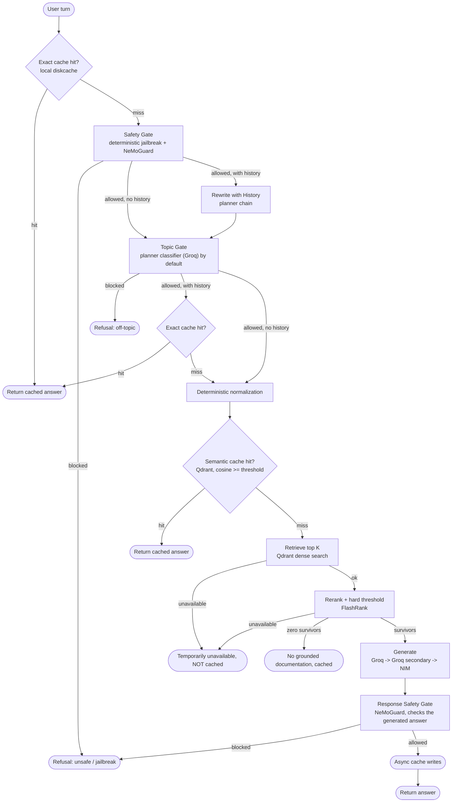

# Kubernetes Gated RAG

A production-oriented RAG system for Kubernetes Q&A, built around defense in depth: versioned two-layer caching, safety and topic gates, hard relevance thresholds, provider failover, and end-to-end tracing. It runs on a no-GPU laptop by offloading model inference to hosted APIs while keeping local compute to parsing, chunking, and CPU reranking.

## Request path



The important latency change is deliberate: a first-turn exact-cache hit does not invoke any remote model (it still runs the free, local jailbreak-pattern check against the raw message before serving the cached answer, closing the gap where a jailbreak-shaped repeat of a previously-approved question would otherwise skip both gates entirely). Context-dependent turns do not use the early exact cache because the same short message can mean different things in different histories. Those turns are rewritten, safety-checked, topic-checked, then get a context-safe exact-cache check (also jailbreak-pattern-checked first).

An infrastructure failure partway through retrieval or reranking (a Qdrant timeout, a FlashRank crash) is routed to a distinct "temporarily unavailable" answer rather than being treated the same as a genuine "no relevant documentation found". Only the latter is cached — conflating the two would let a transient outage get baked into the cache as a wrong answer for as long as `NO_CONTEXT_CACHE_TTL_SECONDS`.

## Guardrails

Safety remains fail-closed. Known jailbreak-shaped requests are rejected locally with deterministic patterns, avoiding a second remote model call. All other requests go through NeMoGuard content-safety. The NeMoGuard call has a short timeout and an automatic circuit breaker; when its circuit is open or the call fails, the planner chain is used as a lower-confidence fallback. If neither path produces a usable verdict, the request is blocked.

The generated answer is checked too, not just the incoming question. The safety prompt and JSON schema always asked the classifier for a `Response Safety` verdict alongside `User Safety`; a response safety gate now actually calls for it, after generation and before the answer is shown or cached, using the same NeMoGuard/fallback/circuit-breaker machinery as the input-side safety gate.

Topic classification defaults to the planner-chain classifier (Groq, via `TOPIC_POLICY_PROMPT`) rather than NeMoGuard topic-control (`GUARDRAIL_SKIP_NEMOGUARD_TOPIC=true` by default): NVIDIA's hosted NeMoGuard topic-control endpoint has been unreliable in practice — a recurring server-side TensorRT-LLM/CUDA error, not something a client-side timeout or retry fixes — so the fallback classifier that was originally built for outages is now the primary path, and the dedicated model is opt-in (`GUARDRAIL_SKIP_NEMOGUARD_TOPIC=false`) for whenever NVIDIA's instance is confirmed healthy. Common greetings and thanks are allowed locally, avoiding a remote round-trip for obvious small talk. Topic failures fail closed when no usable verdict is available from either path.

Safety classification still defaults to NeMoGuard content-safety (`GUARDRAIL_SKIP_NEMOGUARD_SAFETY=false`) since it's been reliable; the same skip switch and circuit breaker exist for it if that changes.

FlashRank failure is fail-closed by default: a retrieval result that has not passed the rerank gate is not silently forwarded to generation. A FlashRank *crash* (as opposed to a real rerank producing zero survivors) is treated as an infrastructure failure and routed to the uncached "temporarily unavailable" answer, not to the cached "no grounded documentation" one.

## Caching

Exact matching uses `diskcache` and is keyed by normalized question plus cache schema, policy, and corpus versions. Semantic matching uses Qdrant and filters by the same version metadata, so old entries cannot silently survive a policy/cache-version change. Exact-match normalization strips only cosmetic punctuation (trailing `?`, quotes, brackets); it deliberately keeps `-`, `/`, `.`, and `:`, since those are meaningful in Kubernetes syntax (`apps/v1`, `pod.spec.containers`) and stripping them previously let two different questions collide onto the same cache key.

The previous LLM canonicalization step is gone. Semantic-cache text normalization is deterministic, cheap, and transparent. Gemini embeddings are persisted locally with a TTL and are reused across requests by task type, model, dimension, and text.

Generated-answer cache writes happen in the background so Qdrant and disk I/O are not placed on the critical response path. The write failures are logged rather than changing the already-generated answer returned to the user; the background executor is drained on process exit so a write in flight isn't silently dropped.

`ingest.py` writes a content fingerprint to `.cache/corpus_version` after every successful run (with or without `--wipe`), and cache keys use that fingerprint as the effective corpus version instead of the static `CORPUS_VERSION` setting once it exists. A normal re-ingest — including an incremental one that only adds or changes a few files — invalidates stale cached answers on its own; `CORPUS_VERSION` is now only the pre-first-ingest fallback. `--wipe` additionally deletes and recreates both Qdrant collections and clears the local exact cache, for reclaiming space rather than for correctness.

## Provider latency budgets

Generation defaults to a 15 second per-provider timeout. Planner operations default to 4 seconds. NeMoGuard calls default to 3 seconds. Provider links fail over immediately on transient errors instead of retrying the same provider before moving on. Qdrant uses a 2 second client timeout for the interactive path.

These values are starting budgets, not universal truths. Generation quality and provider tail latency still depend on the deployed models and network path.

## Configuration

The relevant `.env` settings are:

```text
GUARDRAIL_TIMEOUT_SECONDS=3
GUARDRAIL_CIRCUIT_FAILURE_THRESHOLD=2
GUARDRAIL_CIRCUIT_RECOVERY_SECONDS=30
EMBEDDING_CACHE_TTL_SECONDS=86400
RERANK_FAIL_CLOSED=true
GENERATION_TIMEOUT_SECONDS=15
PLANNER_TIMEOUT_SECONDS=4
CACHE_SCHEMA_VERSION=3
CACHE_POLICY_VERSION=2
CORPUS_VERSION=1
TRACING_LOG_RAW_MESSAGES=false
```

Increase `CACHE_POLICY_VERSION` whenever the safety/topic/cache policy changes in a way that makes an old answer unsuitable — this one is still manual, since "the policy changed" isn't something `ingest.py` can detect. `CORPUS_VERSION` is only a pre-first-ingest fallback now; once `ingest.py` has run at least once, the effective corpus version comes from `.cache/corpus_version`'s content fingerprint and updates automatically on every subsequent ingest. `TRACING_LOG_RAW_MESSAGES` controls whether raw user messages (as opposed to just a length + hash) are attached to Logfire spans; leave it `false` unless you're debugging locally against a private Logfire sink.

`SEMANTIC_CACHE_SIMILARITY_THRESHOLD` and `RERANK_SCORE_THRESHOLD` remain empirical tuning knobs. Retrieval and rerank score distributions should be evaluated on the real corpus before changing them.

## Run

```bash
python3 -m venv venv && source venv/bin/activate
pip install -r requirements.txt
cp .env.example .env
pytest tests/ -v
python ingest.py data --wipe
streamlit run ui/app.py
```

## Structure

```text
kubernetes-gated-rag/
├── ui/app.py
├── src/
│   ├── config.py
│   ├── graph.py
│   ├── tracing.py
│   ├── guardrails/
│   │   ├── colang_rules.py
│   │   └── gates.py
│   ├── ingestion/
│   │   ├── chunking.py
│   │   ├── filters.py
│   │   └── parsers.py
│   ├── providers/
│   │   ├── clients.py
│   │   └── llm.py
│   └── retrieval/
│       ├── cache.py
│       ├── embeddings.py
│       ├── rerank.py
│       └── search.py
├── eval/
├── tests/
├── ingest.py
├── requirements.txt
└── .env.example
```


