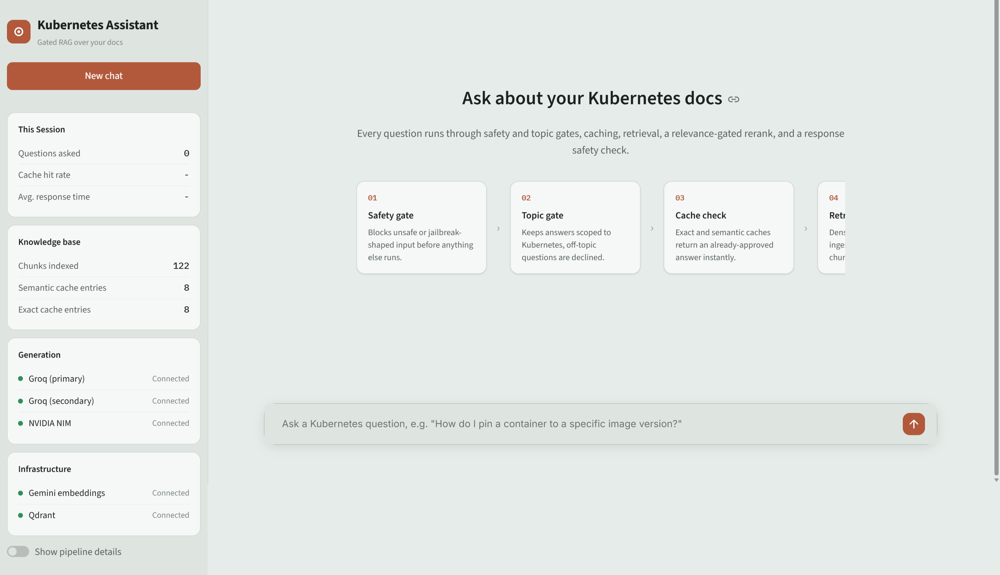
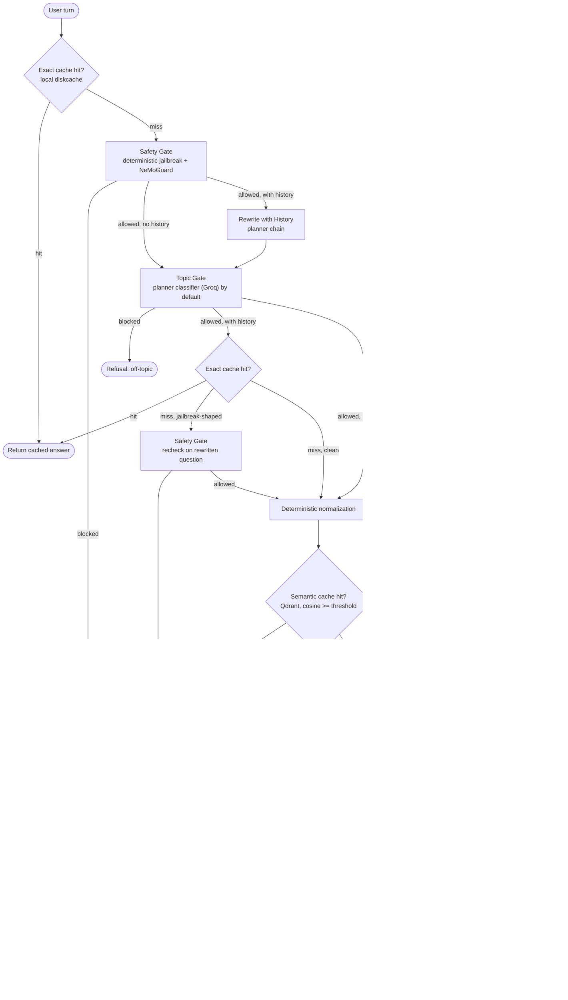

# Kubernetes Gated RAG

A production-oriented RAG system for Kubernetes Q&A that answers only from your own ingested docs, built around defense in depth: versioned two-layer caching, safety and topic gates on both the question and the generated answer, hard relevance thresholds on retrieval, provider failover, and end-to-end tracing.

## Preview

<p align="center">
  
  <br>
  <sub>Landing view: Title, description, question box, and the pipeline's own stages rendered inline.</sub>
</p>

> Additional screenshots in [`assets`](assets/).

## What this does

Given a question, the pipeline:

1. Checks two layers of cache, exact match then semantic similarity, before doing any retrieval or generation.
2. Runs the question through a safety gate (deterministic jailbreak patterns + NeMoGuard) and a topic gate (is this actually about Kubernetes) before spending a generation call on something it shouldn't answer.
3. Retrieves candidate chunks from Qdrant, reranks them, and applies a hard relevance threshold. If nothing clears the bar, it says so instead of guessing.
4. Generates an answer from the surviving context only, then re-checks the *generated answer itself* for safety before it's shown or cached, not just the incoming question.

Anything an infrastructure failure interrupts along the way (a Qdrant timeout, a FlashRank crash, every generation provider being down at once) is surfaced as "temporarily unavailable" and is never cached, so a transient outage can't get baked into the cache as a wrong answer.

## Architecture



The important latency choice is deliberate: a first-turn exact-cache hit does not invoke any remote model (it still runs the free, local jailbreak-pattern check against the raw message before serving the cached answer, closing the gap where a jailbreak-shaped repeat of a previously-approved question would otherwise skip both gates entirely). Context-dependent turns do not use the early exact cache because the same short message can mean different things in different histories. Those turns are rewritten, safety-checked, topic-checked, then get a context-safe exact-cache check (also jailbreak-pattern-checked first), and if that check finds a jailbreak-shaped rewritten question, it's routed through a full safety-gate recheck (deterministic pattern + NeMoGuard/fallback) on the rewritten text rather than just skipping the cache lookup and continuing on unchecked, since `safety_gate` earlier in the same turn only ever saw the pre-rewrite raw message.

## Models

Split across three providers so a single account's rate limit can't take down generation, and so the eval judge is a different model family from anything it's grading:

| Role | Model | Provider | Notes |
|---|---|---|---|
| Generation | `openai/gpt-oss-120b` | Groq → Groq (secondary account) → NIM | Same model string on all three links deliberately: this failover is about separate rate-limit budgets, not model diversity. |
| Planner / rewrite / topic fallback | `nvidia/nemotron-3-super-120b-a12b` → `openai/gpt-oss-20b` | NIM → Groq | Used for history-based query rewriting and the default topic classifier. |
| Topic gate (opt-in) | `nvidia/llama-3.1-nemoguard-8b-topic-control` | NIM (NeMoGuard) | Off by default, NVIDIA's hosted endpoint for this one has a recurring server-side reliability issue, see Guardrails. |
| Safety gate | `nvidia/llama-3.1-nemoguard-8b-content-safety` | NIM (NeMoGuard) | Default for both the input-side and response-side safety checks. |
| Embeddings | `gemini-embedding-001` | Gemini | Semantic cache keys, document chunks, and query embeddings, persisted locally with a TTL. |
| Reranker | `ms-marco-MiniLM-L-12-v2` | FlashRank, local CPU | The only model in the pipeline that isn't a hosted API call. |
| Eval judge | `gemini-3.5-flash` | Gemini | A different family from every model in the live pipeline, so it never grades a model from its own family. |

## Guardrails

 - **Fail-closed safety:** Known jailbreak patterns are blocked locally. All other requests go through NeMoGuard with a short timeout and circuit breaker; failures fall back to the planner. If no usable verdict exists, block the request.
- **Rewrite safety:** Rewritten questions are rechecked for jailbreaks. `safety_gate` runs on the raw message first, with a dedicated recheck if rewriting introduces a known pattern.
- **Response safety:** Generated answers are safety-checked before being shown or cached, using the same NeMoGuard/fallback/circuit-breaker flow.
- **Topic gating:** Planner classification is the default (`GUARDRAIL_SKIP_NEMOGUARD_TOPIC=true`) because NVIDIA's topic endpoint has recurring server-side failures. NeMoGuard topic checks are opt-in. Greetings and thanks are allowed locally. Topic checks fail closed without a usable verdict.
- **Rerank fail-closed:** Only rerank-approved results reach generation. FlashRank crashes are treated as infrastructure failures and return the uncached 'temporarily unavailable' response. If `RERANK_FAIL_CLOSED=false`, raw similarity is allowed only above `RERANK_FALLBACK_SCORE_THRESHOLD`.
- **Generation resilience:** If Groq, its secondary, and NIM all fail, return the same uncached 'temporarily unavailable' response instead of surfacing an error.

## Caching

 - **Exact match:** Uses `diskcache`, keyed by the normalized question plus cache, policy, and corpus versions. Only cosmetic punctuation is stripped; Kubernetes-significant characters like `-`, `/`, `.`, and `:` are preserved to prevent collisions.
- **Semantic match:** Uses Qdrant with the same version filters, preventing stale entries after policy or cache changes. Normalization is deterministic—no LLM canonicalization. Gemini embeddings are locally cached with a TTL and reused by task type, model, dimension, and text.
- **Background writes:** Qdrant and disk writes happen off the critical path. Failures are logged without affecting the response, and in-flight writes are drained on shutdown.
- **Automatic corpus invalidation:** Each successful ingest fingerprints the corpus into `.cache/corpus_version`; cache keys use this fingerprint once available. Any re-ingest automatically invalidates stale answers, including incremental updates. `--wipe` clears exact-cache data and recreates both Qdrant collections for space reclamation, not correctness.

## Provider latency budgets

Generation defaults to a 15 second per-provider timeout. Planner operations default to 4 seconds. NeMoGuard calls default to 3 seconds. Provider links fail over immediately on transient errors instead of retrying the same provider before moving on. Qdrant uses a 5 second client timeout for the interactive path (raised from an earlier 2 seconds, which was too tight for real hosted Qdrant Cloud latency and caused ReadTimeouts on healthy requests).

These values are starting budgets, not universal truths. Generation quality and provider tail latency still depend on the deployed models and network path.

## Configuration

The relevant `.env` settings are:

```text
GUARDRAIL_TIMEOUT_SECONDS=3
GUARDRAIL_CIRCUIT_FAILURE_THRESHOLD=2
GUARDRAIL_CIRCUIT_RECOVERY_SECONDS=30
EMBEDDING_CACHE_TTL_SECONDS=86400
RERANK_FAIL_CLOSED=true
RERANK_FALLBACK_SCORE_THRESHOLD=0.6
GENERATION_TIMEOUT_SECONDS=15
PLANNER_TIMEOUT_SECONDS=4
CACHE_SCHEMA_VERSION=3
CACHE_POLICY_VERSION=2
CORPUS_VERSION=1
TRACING_LOG_RAW_MESSAGES=false
```

## Configuration Notes

 - **`CACHE_POLICY_VERSION`:** Increment manually whenever safety, topic, or cache policy changes enough to invalidate existing answers. This cannot be inferred by `ingest.py`.
- **`CORPUS_VERSION`:** Used only before the first ingest. Afterward, the effective version comes from `.cache/corpus_version` and updates automatically on every ingest.
- **`TRACING_LOG_RAW_MESSAGES`:** Controls whether Logfire spans include raw user messages or only length/hash metadata. Keep `false` unless debugging locally with a private Logfire sink.
- **`RERANK_FALLBACK_SCORE_THRESHOLD`:** Used only when `RERANK_FAIL_CLOSED=false`; it sets the retrieval-similarity cutoff when FlashRank crashes.
- **`SEMANTIC_CACHE_SIMILARITY_THRESHOLD` / `RERANK_SCORE_THRESHOLD`:** Empirical tuning knobs. Evaluate score distributions on the real corpus before changing them.

## Evaluation

 `eval/run_eval.py` uses Ragas to evaluate generation quality across faithfulness, answer relevancy, context precision/recall, context entity recall, and semantic similarity. The judge is `gemini-3.5-flash` via Gemini’s OpenAI-compatible endpoint, keeping evaluation independent from the Groq/NIM generation models. Gemini embeddings are reused for similarity metrics.

 This evaluates **grounding given supplied context**, not the full pipeline. Each row in `eval/eval_set.json` provides its own `retrieved_contexts`; missing answers are generated directly with `generate_main`, bypassing safety/topic gates, caching, retrieval, and reranking. Evaluation is capped at two concurrent rows to stay within Gemini’s rate limits.

 The current evaluation set contains eight hand-written examples—enough to validate the harness, but not enough for strong benchmark conclusions. Treat it as a starter set to expand. Per-row results are written to `eval/results.csv`, with summary statistics printed to stdout.

## Project Structure

```text
kubernetes-gated-rag/
├── .streamlit/config.toml          # Streamlit configuration
├── ui/app.py                       # Streamlit chat UI
│
├── src/
│   ├── config.py                   # environment loading and pipeline configuration
│   ├── graph.py                    # pipeline graph wiring
│   ├── tracing.py                  # Logfire tracing
│   │
│   ├── guardrails/
│   │   ├── jailbreak_patterns.py   # deterministic jailbreak detection
│   │   └── gates.py                # safety and topic gates
│   │
│   ├── ingestion/
│   │   ├── chunking.py             # document chunking
│   │   ├── filters.py              # ingestion relevance filtering
│   │   └── parsers.py              # document parsing
│   │
│   ├── providers/
│   │   ├── circuit_breaker.py      # provider failure/recovery handling
│   │   ├── clients.py              # provider clients
│   │   └── llm.py                  # generation, planning, and rewrite calls
│   │
│   └── retrieval/
│       ├── cache.py                # exact and semantic cache operations
│       ├── embeddings.py           # embedding generation and local cache
│       ├── rerank.py               # FlashRank reranking and thresholds
│       └── search.py               # Qdrant retrieval
│
├── eval/
│   ├── dataset.py                  # eval_set.json loader + schema validation
│   ├── eval_set.json               # 8-row starter set
│   └── run_eval.py                 # Ragas scoring harness
│
├── assets/                         # screenshots, icons and static assets
├── tests/                          # pipeline and guardrail tests
│
├── ingest.py                       # document ingestion entry point
├── .env.example                    # environment variable template
├── pytest.ini                      # pytest configuration
├── requirements.txt                # Python dependencies
└── README.md
```

## Getting started

1. **API keys**, you'll need:
   - NVIDIA NIM: https://build.nvidia.com
   - Groq, two accounts (primary and secondary, used for separate rate-limit budgets): https://console.groq.com/keys
   - Gemini: https://aistudio.google.com/apikey
   - Qdrant Cloud: https://cloud.qdrant.io
   - Logfire (optional, tracing just no-ops without it): https://logfire.pydantic.dev

2. **Install**
   ```bash
   python3 -m venv venv && source venv/bin/activate
   pip install -r requirements.txt
   cp .env.example .env   # fill in every key except LOGFIRE_TOKEN if you're skipping tracing
   ```

3. **Docs and Qdrant collections.** Unlike a hosted database, there's no separate setup step here, `ingest.py` creates both Qdrant collections itself on first run. Put your Kubernetes documentation under a data directory with `true_data/` and/or `noisy_data/` subfolders (`noisy_data` is optional and exists to prove the ingestion relevance gate actually rejects off-topic content, not as a second valid content tier), then run:
   ```bash
   pytest tests/ -v
   python ingest.py data --wipe
   ```

## Running it

```bash
streamlit run ui/app.py            # live chat UI
python -m eval.run_eval            # Ragas scoring against eval/eval_set.json
```

## Known limitations

- `eval/eval_set.json` is an 8-row starter set, not a finished benchmark, see Evaluation above.
- `eval/run_eval.py` tests generation grounding against pre-supplied contexts, it does not exercise the safety/topic gates, caching, retrieval, or rerank stages, so a clean eval run is not by itself evidence that the full pipeline behaves correctly end to end. `tests/` covers those stages instead.
- There is no ablation harness comparing the pipeline with a guardrail or cache layer disabled against the same eval set, unlike the gated-vs-ungated comparisons a fuller eval suite would have. Guardrail behavior is currently verified by `tests/test_guardrails.py`, not by the Ragas eval.