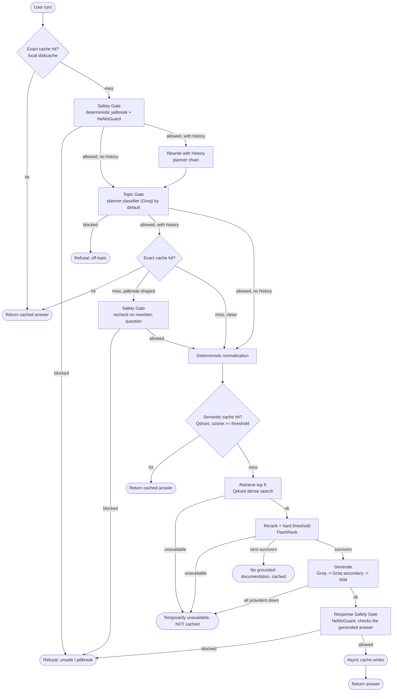

# Kubernetes Gated RAG

A production-oriented RAG system for Kubernetes Q&A that answers only from your own ingested docs, built around defense in depth: versioned two-layer caching, safety and topic gates on both the question and the generated answer, hard relevance thresholds on retrieval, provider failover, and end-to-end tracing.

## What this does

Given a question, the pipeline:

1. Checks two layers of cache, exact match then semantic similarity, before doing any retrieval or generation.
2. Runs the question through a safety gate (deterministic jailbreak patterns + NeMoGuard) and a topic gate (is this actually about Kubernetes) before spending a generation call on something it shouldn't answer.
3. Retrieves candidate chunks from Qdrant, reranks them, and applies a hard relevance threshold. If nothing clears the bar, it says so instead of guessing.
4. Generates an answer from the surviving context only, then re-checks the *generated answer itself* for safety before it's shown or cached, not just the incoming question.

Anything an infrastructure failure interrupts along the way (a Qdrant timeout, a FlashRank crash, every generation provider being down at once) is surfaced as "temporarily unavailable" and is never cached, so a transient outage can't get baked into the cache as a wrong answer.

## Architecture



The important latency choice is deliberate: a first-turn exact-cache hit does not invoke any remote model (it still runs the free, local jailbreak-pattern check against the raw message before serving the cached answer, closing the gap where a jailbreak-shaped repeat of a previously-approved question would otherwise skip both gates entirely). Context-dependent turns do not use the early exact cache because the same short message can mean different things in different histories. Those turns are rewritten, safety-checked, topic-checked, then get a context-safe exact-cache check (also jailbreak-pattern-checked first) — and if that check finds a jailbreak-shaped rewritten question, it's routed through a full safety-gate recheck (deterministic pattern + NeMoGuard/fallback) on the rewritten text rather than just skipping the cache lookup and continuing on unchecked, since `safety_gate` earlier in the same turn only ever saw the pre-rewrite raw message.

## Models

Split across three providers so a single account's rate limit can't take down generation, and so the eval judge is a different model family from anything it's grading:

| Role | Model | Provider | Notes |
|---|---|---|---|
| Generation | `openai/gpt-oss-120b` | Groq → Groq (secondary account) → NIM | Same model string on all three links deliberately: this failover is about separate rate-limit budgets, not model diversity. |
| Planner / rewrite / topic fallback | `nvidia/nemotron-3-super-120b-a12b` → `openai/gpt-oss-20b` | NIM → Groq | Used for history-based query rewriting and the default topic classifier. |
| Topic gate (opt-in) | `nvidia/llama-3.1-nemoguard-8b-topic-control` | NIM (NeMoGuard) | Off by default, NVIDIA's hosted endpoint for this one has a recurring server-side reliability issue, see Guardrails. |
| Safety gate | `nvidia/llama-3.1-nemoguard-8b-content-safety` | NIM (NeMoGuard) | Default for both the input-side and response-side safety checks. |
| Embeddings | `gemini-embedding-001` | Gemini | Semantic cache keys, document chunks, and query embeddings, persisted locally with a TTL. |
| Reranker | `ms-marco-MiniLM-L-12-v2` | FlashRank, local CPU | The only model in the pipeline that isn't a hosted API call. |
| Eval judge | `gemini-3.5-flash` | Gemini | A different family from every model in the live pipeline, so it never grades a model from its own family. |

## Guardrails

- **Fail-closed safety.** Known jailbreak-shaped requests are rejected locally with deterministic patterns, avoiding a remote call. Everything else goes through NeMoGuard content-safety, with a short timeout and an automatic circuit breaker; when the breaker is open or the call fails, the planner chain is used as a lower-confidence fallback. If neither path produces a usable verdict, the request is blocked.
- **Rewritten questions get their own safety check.** A jailbreak-shaped standalone question that only emerges after history-based rewriting (the raw message looked innocuous; rewriting it against chat history produced text matching a known jailbreak pattern) is caught and blocked, not just skipped past the cache. `safety_gate` runs once per turn against the raw message, before any rewrite happens, so the late exact-cache lookup's jailbreak check routes into a dedicated safety-gate recheck against the rewritten text instead of falling through to retrieval and generation unchecked.
- **The answer is checked too, not just the question.** The safety prompt and JSON schema always asked the classifier for a `Response Safety` verdict alongside `User Safety`; a response safety gate calls for it after generation and before the answer is shown or cached, using the same NeMoGuard/fallback/circuit-breaker machinery as the input-side gate.
- **Topic gate defaults to the planner classifier, not NeMoGuard.** NVIDIA's hosted NeMoGuard topic-control endpoint has been unreliable in practice, a recurring server-side TensorRT-LLM/CUDA error, not something a client-side timeout or retry fixes, so `GUARDRAIL_SKIP_NEMOGUARD_TOPIC=true` by default routes topic checks through the planner chain (originally built as the outage fallback) instead. The dedicated model is opt-in for whenever NVIDIA's instance is confirmed healthy. Common greetings and thanks are allowed locally, avoiding a remote round-trip for obvious small talk. Topic failures fail closed when no usable verdict is available from either path.
- **Rerank fail-closed by default.** A retrieval result that hasn't passed the rerank gate is not silently forwarded to generation. A FlashRank *crash* (as opposed to a real rerank producing zero survivors) is treated as an infrastructure failure and routed to the uncached "temporarily unavailable" answer, not the cached "no grounded documentation" one. If `RERANK_FAIL_CLOSED` is explicitly disabled, a crash falls back to raw retrieval similarity, gated by `RERANK_FALLBACK_SCORE_THRESHOLD` rather than forwarding every candidate ungated, since there's no rerank score to threshold on in that path.
- **Generation outage degrades, it doesn't crash.** A full generation-provider outage (Groq, Groq secondary, and NIM all failing) degrades to the same uncached "temporarily unavailable" answer as a retrieval or rerank infrastructure failure, rather than surfacing a raw error.

## Caching

- **Exact match** uses `diskcache`, keyed by normalized question plus cache schema, policy, and corpus versions. Normalization strips only cosmetic punctuation (trailing `?`, quotes, brackets); it deliberately keeps `-`, `/`, `.`, and `:`, since those are meaningful in Kubernetes syntax (`apps/v1`, `pod.spec.containers`) and stripping them previously let two different questions collide onto the same cache key.
- **Semantic match** uses Qdrant, filtered by the same version metadata so old entries can't silently survive a policy or cache-version change. Normalization is deterministic and cheap, there's no LLM canonicalization step. Gemini embeddings are persisted locally with a TTL and reused across requests by task type, model, dimension, and text.
- **Cache writes happen in the background.** Qdrant and disk I/O are not on the critical response path; write failures are logged rather than changing the already-generated answer, and the background executor is drained on process exit so a write in flight isn't silently dropped.
- **Corpus versioning is automatic after the first ingest.** `ingest.py` writes a content fingerprint to `.cache/corpus_version` after every successful run, and cache keys use that fingerprint instead of the static `CORPUS_VERSION` setting once it exists. A normal re-ingest, including an incremental one that only touches a few files, invalidates stale cached answers on its own. `--wipe` additionally deletes and recreates both Qdrant collections and clears the exact cache, for reclaiming space rather than for correctness.

## Provider latency budgets

Generation defaults to a 15 second per-provider timeout. Planner operations default to 4 seconds. NeMoGuard calls default to 3 seconds. Provider links fail over immediately on transient errors instead of retrying the same provider before moving on. Qdrant uses a 5 second client timeout for the interactive path (raised from an earlier 2 seconds, which was too tight for real hosted Qdrant Cloud latency and caused ReadTimeouts on healthy requests).

These values are starting budgets, not universal truths. Generation quality and provider tail latency still depend on the deployed models and network path.

## Configuration

The relevant `.env` settings are:

```text
GUARDRAIL_TIMEOUT_SECONDS=3
GUARDRAIL_CIRCUIT_FAILURE_THRESHOLD=2
GUARDRAIL_CIRCUIT_RECOVERY_SECONDS=30
EMBEDDING_CACHE_TTL_SECONDS=86400
RERANK_FAIL_CLOSED=true
RERANK_FALLBACK_SCORE_THRESHOLD=0.6
GENERATION_TIMEOUT_SECONDS=15
PLANNER_TIMEOUT_SECONDS=4
CACHE_SCHEMA_VERSION=3
CACHE_POLICY_VERSION=2
CORPUS_VERSION=1
TRACING_LOG_RAW_MESSAGES=false
```

Increase `CACHE_POLICY_VERSION` whenever the safety/topic/cache policy changes in a way that makes an old answer unsuitable, this one is still manual, since "the policy changed" isn't something `ingest.py` can detect. `CORPUS_VERSION` is only a pre-first-ingest fallback now; once `ingest.py` has run at least once, the effective corpus version comes from `.cache/corpus_version`'s content fingerprint and updates automatically on every subsequent ingest. `TRACING_LOG_RAW_MESSAGES` controls whether raw user messages, as opposed to just a length and hash, are attached to Logfire spans; leave it `false` unless you're debugging locally against a private Logfire sink. `RERANK_FALLBACK_SCORE_THRESHOLD` only matters if `RERANK_FAIL_CLOSED=false`, it's the retrieval-similarity cutoff used in place of a rerank score when FlashRank itself has crashed.

`SEMANTIC_CACHE_SIMILARITY_THRESHOLD` and `RERANK_SCORE_THRESHOLD` remain empirical tuning knobs. Retrieval and rerank score distributions should be evaluated on the real corpus before changing them.

## Evaluation

`eval/run_eval.py` scores generation quality with [Ragas](https://docs.ragas.io/): faithfulness, answer relevancy, context precision, context recall, context entity recall, and semantic similarity against a reference answer.

- The judge is `gemini-3.5-flash`, called through Gemini's OpenAI-compatible endpoint, chosen specifically because it's a different model family from both live generation chains (Groq/NIM `gpt-oss`, NIM `nemotron`), so it never grades a model from its own family. Embeddings for the similarity metrics reuse the project's own Gemini embedding function.
- Scope note: this evaluates generation grounding, not the full gated pipeline. Each row in [`eval/eval_set.json`](eval/eval_set.json) supplies its own `retrieved_contexts` directly; if the row doesn't already include a precomputed `answer`, `run_eval.py` generates one fresh via `generate_main` on those contexts, it does not run the question through the safety/topic gates, caching, retrieval, or rerank. It's answering "given this context, does the model stay faithful to it," not "does the end-to-end pipeline retrieve the right context in the first place."
- Gemini's free tier is far tighter than Groq's for `gemini-3.5-flash` (roughly 15 requests/minute at time of writing), and every row fires several judge and embedding calls concurrently, so scoring is capped at 2 rows in flight at once (`_JUDGE_CONCURRENCY` in `run_eval.py`) to stay under that limit even for a small eval set.
- [`eval/eval_set.json`](eval/eval_set.json) currently holds 8 hand-written rows. That's enough to exercise the harness end to end, not enough to draw strong conclusions from, treat it as a starter set to grow rather than a finished benchmark.
- Results are written to `eval/results.csv` per row, with summary statistics printed to stdout.

## Getting started

1. **API keys**, you'll need:
   - NVIDIA NIM: https://build.nvidia.com
   - Groq, two accounts (primary and secondary, used for separate rate-limit budgets): https://console.groq.com/keys
   - Gemini: https://aistudio.google.com/apikey
   - Qdrant Cloud: https://cloud.qdrant.io
   - Logfire (optional, tracing just no-ops without it): https://logfire.pydantic.dev

2. **Install**
   ```bash
   python3 -m venv venv && source venv/bin/activate
   pip install -r requirements.txt
   cp .env.example .env   # fill in every key except LOGFIRE_TOKEN if you're skipping tracing
   ```

3. **Docs and Qdrant collections.** Unlike a hosted database, there's no separate setup step here, `ingest.py` creates both Qdrant collections itself on first run. Put your Kubernetes documentation under a data directory with `true_data/` and/or `noisy_data/` subfolders (`noisy_data` is optional and exists to prove the ingestion relevance gate actually rejects off-topic content, not as a second valid content tier), then run:
   ```bash
   pytest tests/ -v
   python ingest.py data --wipe
   ```

## Running it

```bash
streamlit run ui/app.py            # live chat UI
python -m eval.run_eval            # Ragas scoring against eval/eval_set.json
```

## Structure

```text
kubernetes-gated-rag/
├── ui/app.py
├── src/
│   ├── config.py
│   ├── graph.py
│   ├── tracing.py
│   ├── guardrails/
│   │   ├── jailbreak_patterns.py
│   │   └── gates.py
│   ├── ingestion/
│   │   ├── chunking.py
│   │   ├── filters.py
│   │   └── parsers.py
│   ├── providers/
│   │   ├── clients.py
│   │   └── llm.py
│   └── retrieval/
│       ├── cache.py
│       ├── embeddings.py
│       ├── rerank.py
│       └── search.py
├── eval/
│   ├── dataset.py              # eval_set.json loader + schema validation
│   ├── run_eval.py             # Ragas scoring harness
│   └── eval_set.json           # 8-row starter set
├── tests/
├── ingest.py
├── requirements.txt
└── .env.example
```

## Known limitations

- `eval/eval_set.json` is an 8-row starter set, not a finished benchmark, see Evaluation above.
- `eval/run_eval.py` tests generation grounding against pre-supplied contexts, it does not exercise the safety/topic gates, caching, retrieval, or rerank stages, so a clean eval run is not by itself evidence that the full pipeline behaves correctly end to end. `tests/` covers those stages instead.
- There is no ablation harness comparing the pipeline with a guardrail or cache layer disabled against the same eval set, unlike the gated-vs-ungated comparisons a fuller eval suite would have. Guardrail behavior is currently verified by `tests/test_guardrails.py`, not by the Ragas eval.