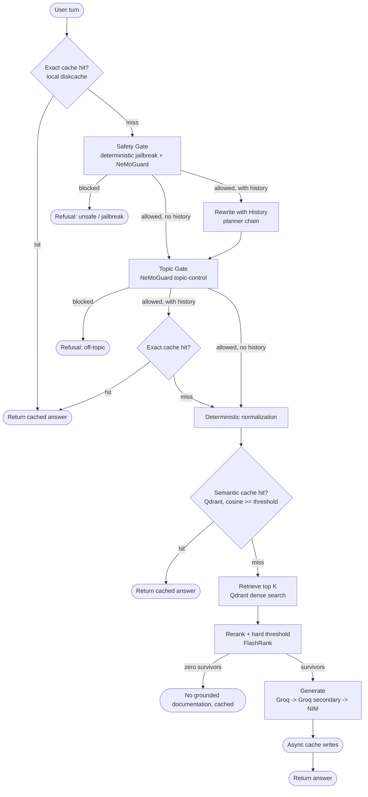

# Kubernetes Gated RAG

A production-oriented RAG system for Kubernetes Q&A, built around defense in depth: versioned two-layer caching, safety and topic gates, hard relevance thresholds, provider failover, and end-to-end tracing. It runs on a no-GPU laptop by offloading model inference to hosted APIs while keeping local compute to parsing, chunking, and CPU reranking.

## Request path



The important latency change is deliberate: a first-turn exact-cache hit does not invoke any remote model. Context-dependent turns do not use the early exact cache because the same short message can mean different things in different histories. Those turns are rewritten, safety-checked, topic-checked, then get a context-safe exact-cache check.

## Guardrails

Safety remains fail-closed. Known jailbreak-shaped requests are rejected locally with deterministic patterns, avoiding a second remote model call. All other requests go through NeMoGuard content-safety. The NeMoGuard call has a short timeout and an automatic circuit breaker; when its circuit is open or the call fails, the planner chain is used as a lower-confidence fallback. If neither path produces a usable verdict, the request is blocked.

Topic classification remains NeMoGuard-based because open-ended topic detection is not a good fit for a small keyword list. Common greetings and thanks are allowed locally, avoiding a remote round-trip for obvious small talk. Topic failures also use a short-timeout planner fallback and fail closed when no usable verdict is available.

FlashRank failure is fail-closed by default. A retrieval result that has not passed the rerank gate is not silently forwarded to generation.

## Caching

Exact matching uses `diskcache` and is keyed by normalized question plus cache schema, policy, and corpus versions. Semantic matching uses Qdrant and filters by the same version metadata, so old entries cannot silently survive a policy/cache-version change.

The previous LLM canonicalization step is gone. Semantic-cache text normalization is deterministic, cheap, and transparent. Gemini embeddings are persisted locally with a TTL and are reused across requests by task type, model, dimension, and text.

Generated-answer cache writes happen in the background so Qdrant and disk I/O are not placed on the critical response path. The write failures are logged rather than changing the already-generated answer returned to the user.

`ingest.py --wipe` still deletes and recreates both Qdrant collections and clears the local exact cache. Increase `CORPUS_VERSION` when moving between corpus versions without a full wipe.

## Provider latency budgets

Generation defaults to a 15 second per-provider timeout. Planner operations default to 4 seconds. NeMoGuard calls default to 3 seconds. Provider links fail over immediately on transient errors instead of retrying the same provider before moving on. Qdrant uses a 2 second client timeout for the interactive path.

These values are starting budgets, not universal truths. Generation quality and provider tail latency still depend on the deployed models and network path.

## Configuration

The relevant `.env` settings are:

```text
GUARDRAIL_TIMEOUT_SECONDS=3
GUARDRAIL_CIRCUIT_FAILURE_THRESHOLD=2
GUARDRAIL_CIRCUIT_RECOVERY_SECONDS=30
EMBEDDING_CACHE_TTL_SECONDS=86400
RERANK_FAIL_CLOSED=true
GENERATION_TIMEOUT_SECONDS=15
PLANNER_TIMEOUT_SECONDS=4
CACHE_SCHEMA_VERSION=3
CACHE_POLICY_VERSION=2
CORPUS_VERSION=1
```

Increase `CACHE_POLICY_VERSION` whenever the safety/topic/cache policy changes in a way that makes an old answer unsuitable. Increase `CORPUS_VERSION` for a new corpus revision when you are not deleting and rebuilding the semantic cache collection.

`SEMANTIC_CACHE_SIMILARITY_THRESHOLD` and `RERANK_SCORE_THRESHOLD` remain empirical tuning knobs. Retrieval and rerank score distributions should be evaluated on the real corpus before changing them.

## Run

```bash
python3 -m venv venv && source venv/bin/activate
pip install -r requirements.txt
cp .env.example .env
pytest tests/ -v
python ingest.py data --wipe
streamlit run ui/app.py
```

## Structure

```text
kubernetes-gated-rag/
├── ui/app.py
├── src/
│   ├── config.py
│   ├── graph.py
│   ├── tracing.py
│   ├── guardrails/
│   │   ├── colang_rules.py
│   │   └── gates.py
│   ├── ingestion/
│   │   ├── chunking.py
│   │   ├── filters.py
│   │   └── parsers.py
│   ├── providers/
│   │   ├── clients.py
│   │   └── llm.py
│   └── retrieval/
│       ├── cache.py
│       ├── embeddings.py
│       ├── rerank.py
│       └── search.py
├── eval/
├── tests/
├── ingest.py
├── requirements.txt
└── .env.example
```
