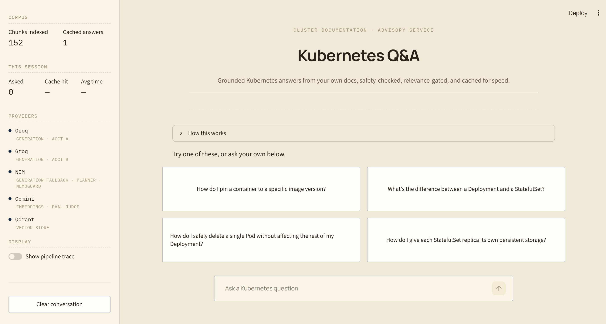

# Kubernetes Gated RAG

A retrieval-augmented Q&A system for Kubernetes questions, gated at every stage rather than trusting any single check: a safety gate and topic gate before a message is even processed, a hard relevance threshold that drops weak retrieval matches instead of just reordering them, and fail-closed behavior at every one of those gates except one documented exception (see Guardrails below), a classifier error blocks a request rather than letting it through. Built to run entirely on a no-GPU, 16GB laptop by offloading every model-weight operation to free-tier hosted APIs; local compute is limited to parsing, chunking, and CPU/ONNX reranking.

Not a scale project, a demonstration of the pieces that separate a "wrap an LLM around a vector search" demo from something closer to production shape: two-layer caching with intent preservation, structure-aware chunking that respects Kubernetes manifest boundaries, a hard-gated reranker instead of similarity-only retrieval, redundant provider failover, and full request tracing.

## Preview

<p align="center">
  
  <br>
  <sub><em>Landing view, with the pipeline's own architecture collapsed under "How this works".</em></sub>
</p>

> Additional screenshots (`sidebar.png`, `cache_hit.png`, `example_search.png`, `safety_and_topic_gate.png`) are in [`assets/`](assets/) using that naming convention, for different stages/scenarios of pipeline.

## What this is

Given a message, the system:

1. **Guards first:** Runs independent safety and topic gates before any downstream processing; both fail closed on classifier errors.
2. **Cache lookup:** Checks exact-match, then canonicalized semantic-match cache, returning immediately on a hit.
3. **Retrieve and rerank:** On a miss, retrieves candidates from Qdrant and reranks them with a cross-encoder, hard-dropping results below the relevance threshold.
4. **Grounded generation:** Generates strictly from the surviving context, or returns a cached *“no grounded documentation”* response when none qualifies.
5. **Cache the result:** Writes the answer to both cache layers, eliminating repeat retrieval and generation costs for identical and paraphrased questions.

Implemented as a **LangGraph state machine**, not a linear script: every node is independently callable and testable. Generation fails over across two accounts with one vendor plus a second vendor (**Groq → Groq (2nd account) → NIM**) on transient errors only; the planner uses the reverse order (**NIM → Groq**). See **Models** for the rationale and resilience tradeoff.

Every node and provider call is traced with **Logfire**. The system is exposed through a **Streamlit** UI and includes a **RAGAS-based evaluation harness**.

## Architecture

```mermaid
flowchart TD
    Start([User turn]) --> Safety[Safety Gate\nColang + NeMoGuard content-safety]
    Safety -->|blocked| RefusalUnsafe([Refusal: unsafe / jailbreak])
    Safety -->|allowed| Rewrite[Rewrite with History\nplanner chain]
    Rewrite --> Topic[Topic Gate\nNeMoGuard topic-control]
    Topic -->|blocked| RefusalOffTopic([Refusal: off-topic])
    Topic -->|allowed| ExactCache{Exact cache hit?\nSQLite}
    ExactCache -->|hit| ReturnExact([Return cached answer])
    ExactCache -->|miss| Canonicalize[Canonicalize Question\nplanner chain]
    Canonicalize --> SemanticCache{Semantic cache hit?\nQdrant, cosine at least 0.95}
    SemanticCache -->|hit| ReturnSemantic([Return cached answer])
    SemanticCache -->|miss| Retrieve[Retrieve top 20\nQdrant dense search]
    Retrieve --> Rerank[Rerank + hard threshold gate\nFlashRank cross-encoder]
    Rerank -->|zero survivors| NoContext([No grounded documentation, cached])
    Rerank -->|survivors| Generate[Generate\nGroq -> Groq(2nd acct) -> NIM chain]
    Generate --> WriteCache[Write exact + semantic cache]
    WriteCache --> ReturnAnswer([Return answer])
```

* **Safety Gate** runs on the raw message before any LLM call, rejecting jailbreaks before they incur planner cost. Two checks run concurrently; either can block: a NeMo Guardrails (Colang) few-shot flow for jailbreak patterns, and NVIDIA NeMoGuard for broader unsafe content (e.g. violence, harassment, and prompt injection). NeMoGuard calls NIM directly; it has no failover target.

* **Topic Gate** runs on the rewritten standalone question, so context-dependent follow-ups are judged with their context preserved. NVIDIA's NeMoGuard topic-control model is a LoRA-tuned classifier for open-ended topic classification, not a general-purpose LLM. `TOPIC_POLICY_PROMPT` in `src/guardrails/gates.py` intentionally follows NVIDIA's required persona + guidelines structure. **Keep this structure when modifying the prompt**; an earlier variant misclassified even clearly on-topic questions.

* **Both gates fail closed:** classifier errors and unparseable responses block the request. Verdict parsing checks only the model's first token, avoiding false matches when a model adds explanations.

* **Exact + semantic cache** are independent layers. Exact matching is cheap and has no false positives but only catches identical questions; semantic matching catches paraphrases but depends on canonicalization preserving intent (e.g. `create` vs. `destroy`). The canonical question is embedded once per turn and reused for both lookup and, on a miss, the cache write.

* **Rerank + gate** are separate: FlashRank reorders candidates, then a hard score threshold removes low-relevance results. If FlashRank fails to load or errors during inference, retrieval falls back to unfiltered order rather than blocking the turn—the exception to the fail-closed model.

* **No-context results are cached** in the exact-match layer with a short TTL, avoiding repeated retrieval/reranking for questions with no matching documentation while allowing corpus updates to take effect.

* **Ingestion has a separate relevance gate:** `ingest.py` classifies each document excerpt before chunking/embedding and skips off-topic content. Unlike query-time `safety_gate`/`topic_gate`, ingestion fails **open** on classifier errors; a missed rejection leaves extra corpus content for the query-time rerank gate to filter, while false rejections can silently reduce an ingestion batch.

## Models

| Role | Model | Provider(s) | Notes |
|---|---|---|---|
| Main generation | `openai/gpt-oss-120b` (both Groq links, NIM) | Groq (account A) &rarr; Groq (account B) &rarr; NVIDIA NIM | retry-then-failover per link, transient errors only; the two Groq links are the same model on separate accounts, so a per-key rate cap doesn't immediately cost a hop to NIM's higher latency, NIM is still there for a genuine Groq-platform outage |
| Planner (rewrite, canonicalize, ingestion relevance) | `meta/llama-3.1-8b-instruct` (NIM), `openai/gpt-oss-20b` (Groq) | NVIDIA NIM &rarr; Groq | reversed order from main generation on purpose; kept off the main generation model's rate budget entirely |
| Safety / topic classification | NeMoGuard content-safety, NeMoGuard topic-control | NVIDIA NIM only, no fallback (fails closed) | called directly, not through the planner chain, see Guardrails |
| Jailbreak detection | Colang few-shot flow | Groq-backed, no fallback (fails closed) | pattern matching suits jailbreak-shaped attempts specifically, runs concurrently with the NeMoGuard safety check above |
| Embeddings | `gemini-embedding-001`, truncated to 768 dims | Google Gemini, no fallback | GA, free tier, 768 dims keeps Qdrant storage well under free-tier limits |
| Eval judge | `gemini-3.5-flash` | Google Gemini, via its OpenAI-compatible endpoint | separate model family from both live chains (Groq gpt-oss, NIM llama), so nothing grades output from a model in its own family |

## Guardrails

- **Fail-closed gates**: both the Safety and Topic gates block on any classifier error or unparseable verdict rather than letting the request through, the opposite default from the ingestion gate below.
- **Two independent safety checks, dispatched concurrently**: a Colang few-shot flow for jailbreak-*pattern* detection, and NeMoGuard's content-safety model for broader unsafe-content categories, either firing is enough to block; concurrent dispatch means the gate's latency is bounded by the slower of the two, not their sum.
- **Hard rerank threshold, not just reordering**, with one documented exception: FlashRank reorders candidates by relevance, then anything below the score threshold is dropped entirely, not merely deprioritized. If FlashRank itself fails (model load error, inference exception), the gate degrades to unfiltered retrieval order rather than blocking the turn, this is a deliberate availability-over-strictness tradeoff (`src/retrieval/rerank.py`), and the one place in this project that doesn't fail closed the way the safety/topic gates do.
- **Ingestion has its own, separately-tuned gate that fails open**: the opposite default from the query-time gates, deliberately, a missed rejection at ingest time is cheap (the rerank gate likely filters it per-query anyway), but a false rejection silently shrinks a batch ingestion job with nobody watching to notice.
- **Provider timeouts**: 15s per OpenAI-compatible client call, so a single unresponsive provider in the chain costs at most ~30s (one retry) before the request moves to the next provider.

## Caching

Two independent layers, checked in order, both scoped per Qdrant collection rather than per user:

- **Exact match** → the standalone question, normalized, hits SQLite directly. Zero false-positive risk, but only catches identical questions.
- **Semantic match, cosine ≥ `SEMANTIC_CACHE_SIMILARITY_THRESHOLD`** → the canonicalized question's embedding is checked against Qdrant. Catches paraphrases, but only as well as the canonicalization step preserves intent first, `"create X"` and `"destroy X"` must never converge onto the same canonical text.
- **No match** → full retrieval, rerank, and generation, followed by a write to both layers.

A confirmed "no grounded documentation" outcome is cached too, under a short TTL (`NO_CONTEXT_CACHE_TTL_SECONDS`), so a repeated unanswerable question doesn't re-pay retrieval every time, while still expiring on its own if the corpus is later updated.

## Safety

Retrieved context here comes only from your own ingested, gate-filtered corpus, not the open web, so the classic prompt-injection-via-search-results surface doesn't apply the same way it would to an agent that fetches live pages. The actual trust boundary is narrower and more direct: whatever safety or topic risk exists depends entirely on what you choose to ingest into `data/`, the query-time guardrails exist to filter what users can *ask*, not to sanitize what the corpus itself contains.

## Project structure

```
kubernetes-gated-rag/
├── .streamlit/config.toml                # theme, toolbar mode
├── ui/app.py                             # Streamlit chat UI (rerun-safe via st.chat_input)
│
├── src/                                  # Core RAG pipeline
│   ├── config.py                         # application settings, retrieval/rerank thresholds
│   ├── tracing.py                        # Logfire tracing and observability
│   ├── graph.py                          # LangGraph orchestration/state machine, ties every package below together
│   │
│   ├── providers/                        # model-provider plumbing, no RAG-specific logic
│   │   ├── clients.py                    # NIM, Groq (2 accounts), Gemini & Qdrant client singletons with timeouts
│   │   └── llm.py                        # generate_main: Groq -> Groq(2nd acct) -> NIM. generate_planner: NIM -> Groq
│   │
│   ├── guardrails/                       # query-time safety, independent of retrieval
│   │   ├── gates.py                      # safety_gate() (Colang + NeMoGuard content-safety) & topic_gate() (NeMoGuard topic-control), both fail-closed
│   │   └── colang_rules.py               # Colang jailbreak-flow definitions for the safety gate
│   │
│   ├── ingestion/                        # offline: turns raw documents into stored chunks
│   │   ├── parsers.py                    # PDF, HTML, TXT, DOCX, PPTX & YAML text extraction
│   │   ├── chunking.py                   # markdown-header & Kubernetes-manifest-aware chunking
│   │   └── filters.py                    # ingestion-time document relevance classifier (fails open)
│   │
│   └── retrieval/                        # online: turns a question into grounded context
│       ├── embeddings.py                 # Gemini embedding generation, batched, rate-limit-aware retry
│       ├── search.py                     # Qdrant dense vector retrieval
│       ├── rerank.py                     # FlashRank reranking + hard relevance threshold, lazy-loaded
│       └── cache.py                      # exact-match and semantic caching layers
│
├── data/
│   ├── true_data/                        # the real corpus, bring your own
│   └── noisy_data/                       # off-topic content the ingestion gate should reject
│
├── eval/
│   ├── eval_set.json                     # starter evaluation dataset
│   ├── dataset.py                        # eval set loader/validator
│   └── run_eval.py                       # RAGAS evaluation (6 retrieval & generation metrics)
│
├── tests/
├── ingest.py                             # CLI pipeline: parse → relevance-gate → chunk → embed → upsert
│
├── .env.example                          # API keys for NIM, Groq (2 accounts), Gemini & Qdrant
├── .gitignore
├── requirements.txt                      # project dependencies
└── README.md
```

## Getting started

1. **API keys**, you'll need:
   - NVIDIA NIM: https://build.nvidia.com
   - Groq: https://console.groq.com/keys, **two separate accounts**, `GROQ_API_KEY` and `GROQ_API_KEY_SECONDARY` need to be genuinely different accounts (see step 2 below for why one key twice doesn't work)
   - Gemini: https://aistudio.google.com/apikey
   - Qdrant (free tier): https://qdrant.tech
   - Logfire (optional, tracing just no-ops without it): https://logfire.pydantic.dev

2. **Install**
   ```bash
   python3 -m venv venv && source venv/bin/activate   # Windows: venv\Scripts\activate
   pip install -r requirements.txt
   cp .env.example .env   # fill in NVIDIA_NIM_API_KEY, GROQ_API_KEY, GROQ_API_KEY_SECONDARY, GEMINI_API_KEY, QDRANT_URL, QDRANT_API_KEY
   ```
   `GROQ_API_KEY_SECONDARY` must be a genuinely separate Groq account, not the same key repeated, it exists to dodge per-key rate caps on the primary account, which a duplicate key does nothing for.

3. **Corpus.** `data/` follows a `true_data/` (the real corpus) and `noisy_data/` (off-topic content, expected to be rejected by the ingestion relevance gate, not a lower-trust second tier) convention, both directories run through the same `ingest_directory()` path in `ingest.py`. Bring your own, there's no bundled starter corpus or fetch script in this project, that's deliberate: any doc-fetching tool needs to be run by you, against sources you've checked, not shipped as something that silently pulls third-party content on your behalf.

## Running it

```bash
pytest tests/ -v                # full suite, mocked, no real API keys or network needed
python ingest.py data --wipe    # parse -> relevance-gate -> chunk -> embed -> upsert into Qdrant
                                # --wipe also clears the semantic cache collection
                                # and the local exact cache, so a corpus refresh can't leave stale cached answers
streamlit run ui/app.py         # chat UI
```

The Streamlit UI warms up the safety and rerank models once at startup (with its own loading indicator), not silently inside the first user question's latency. Toggle "Show pipeline trace" in the sidebar to see exactly which stages a given turn ran and what each one decided, safety verdict, topic verdict, which cache layer (if any) hit, how many candidates survived reranking, and which provider ultimately served the answer.

## Configuration: the two threshold knobs

Both live in `.env`, both need empirical tuning against your own corpus and query patterns, there's no universally correct value.

**`SEMANTIC_CACHE_SIMILARITY_THRESHOLD`** (default `0.95`), cosine similarity floor for a semantic cache hit.
- Too loose: unrelated questions return a stale cached answer.
- Too tight: genuine paraphrases ("what is X" vs "tell me about X") miss the cache and pay full generation cost every time. If you see this, check `canonicalize_question`'s output first, the canonicalizer is supposed to converge same-intent phrasings onto near-identical text before the embedding check ever runs. Lowering the threshold is the second lever, not the first.

**`RERANK_SCORE_THRESHOLD`** (default `0.5`), FlashRank cross-encoder score floor; anything below is dropped, not just deprioritized.
- Too loose: noisy, weakly-related chunks reach the generator and it hallucinates around them.
- Too tight: everything gets dropped and the system claims it has no documentation when it does. Cross-encoder scores are **not calibrated probabilities**, don't assume 0.5 means "50% confident." Before trusting any value, print the actual score distribution for a few real queries against your corpus (a quick REPL call to `src.retrieval.rerank._get_ranker().rerank(...)` on a handful of retrieved candidates) and set the threshold relative to what you actually see, not the default.

There's also **`NO_CONTEXT_CACHE_TTL_SECONDS`** (default `3600`), how long a cached "no grounded documentation" answer is trusted before the next identical question re-checks retrieval, lower it if you're actively adding to the corpus and don't want a stale no-context verdict to outlive a re-ingest.

## Evaluation

```bash
python eval/run_eval.py
```

- Runs RAGAS's six metrics (faithfulness, answer relevancy, context precision/recall, context entity recall, semantic similarity) against `eval/eval_set.json`.
- Judged by `gemini-3.5-flash` via Gemini's OpenAI-compatible endpoint, deliberately a different model family from both live chains (Groq gpt-oss, NIM llama), for the same reason the eval judge is isolated from the generation models in most agent evals: a model shouldn't be grading output from a model in its own family. Gemini's free tier has a much tighter RPM cap than Groq's, so eval row scoring is concurrency-limited (`_JUDGE_CONCURRENCY` in `eval/run_eval.py`) rather than fully parallel, raise it if you're on a paid Gemini tier.
- The included eval set is 8 hand-built pairs grounded in the shipped synthetic corpus, enough to confirm the eval path actually runs end-to-end, not a real benchmark. Extend it with real Q&A pairs before drawing conclusions from the scores.

## Known limitations

- **NeMoGuard classifiers run on NIM, not Groq, so they're a few seconds slower per call than the generation chain's LPU-backed hops**, real, but modest, in exchange for purpose-built calibration over a general-purpose LLM told to output one word.
- **Jailbreak detection is few-shot pattern matching** (Colang), not a dedicated jailbreak-classification model. It catches attempts that resemble the examples in `colang_rules.py`, backed by NeMoGuard's content-safety check; genuinely novel phrasing can still slip past both.
- No conversation persistence, history lives in `st.session_state` and is lost on page reload. The exact/semantic caches persist independently of chat history, so repeated questions across sessions still benefit from caching even though the visible transcript doesn't.
- Single-user local demo, not multi-tenant. The exact cache is a local SQLite file (`.cache/exact`); the semantic cache lives in Qdrant and is shared across every session hitting the same Qdrant collection.