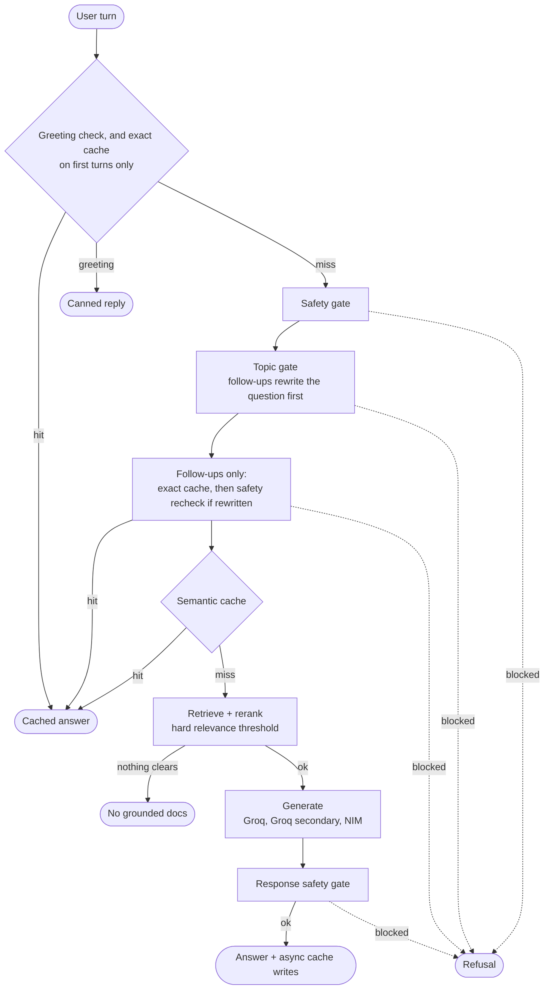

# Kubernetes Gated RAG

A production-oriented RAG system for Kubernetes Q&A that answers only from your own ingested docs, built around defense in depth: versioned two-layer caching, safety and topic gates on both the question and the generated answer, hard relevance thresholds on retrieval, provider failover, and end-to-end tracing.

## Preview

<p align="center">
  
  <br>
  <sub>Landing view: Title, description, question box, and the pipeline's own stages rendered inline.</sub>
</p>

> Additional screenshots in [`assets`](assets/).

## What this does

Given a question, the pipeline:

1. Checks two layers of **cache**, exact match then semantic similarity, before doing any retrieval or generation.
2. Runs the question through a **safety gate** (deterministic jailbreak patterns + NeMoGuard) and a topic gate (is this actually about Kubernetes) before spending a generation call on something it shouldn't answer.
3. **Retrieves** candidate chunks from Qdrant, reranks them, and applies a hard relevance threshold. If nothing clears the bar, it says so instead of guessing.
4. **Generates** an answer from the surviving context only, then re-checks the *generated answer itself* for safety before it's shown or cached, not just the incoming question.

Infrastructure failures (a Qdrant timeout, a FlashRank crash, every generation provider down, an unreachable safety or topic classifier) return "temporarily unavailable" and are never cached. A classifier outage is reported as an outage, not a policy refusal, and an answer whose response-safety check could not run is withheld.

## Architecture


```mermaid
flowchart TD
    Start([User turn]) --> Exact{"Greeting check, and exact cache\non first turns only"}
    Exact -->|hit| Cached([Cached answer])
    Exact -->|greeting| Hello([Canned reply])
    Exact -->|miss| Safety["Safety gate"]
    Safety --> Topic["Topic gate\nfollow-ups rewrite the question first"]
    Topic --> Recheck["Follow-ups only:\nexact cache, then safety recheck if rewritten"]
    Recheck -->|hit| Cached
    Recheck --> Semantic{"Semantic cache"}
    Semantic -->|hit| Cached
    Semantic -->|miss| Retrieve["Retrieve + rerank\nhard relevance threshold"]
    Retrieve -->|nothing clears| NoDocs([No grounded docs])
    Retrieve -->|ok| Generate["Generate\nGroq, Groq secondary, NIM"]
    Generate --> Check["Response safety gate"]
    Check -->|ok| Answer([Answer + async cache writes])
    Safety -.->|blocked| Refusal([Refusal])
    Topic -.->|blocked| Refusal
    Recheck -.->|blocked| Refusal
    Check -.->|blocked| Refusal
```

- A first-turn exact-cache hit calls no remote model.
- Turns with history skip the early cache and are rewritten. If the rewrite changed the question, it gets its own safety check.
- A failed or unusable rewrite (empty, multi-line, oversized) marks the turn degraded: it is answered, but no cache is read or written.
- The UI sends only answered turns as history (no refusals, errors, outages or greetings), capped at `HISTORY_MAX_MESSAGES`.

## Models
 
| Role | Model | Provider | Notes |
|---|---|---|---|
| Generation | `openai/gpt-oss-120b` | Groq -> Groq (secondary account) -> NIM | Same model on every link: separate rate-limit budgets. Auth, permission and not-found errors also fail over. |
| Planner / rewrite / topic fallback | `nvidia/nemotron-3-super-120b-a12b` -> `openai/gpt-oss-20b` | NIM -> Groq | Rewrite, default topic classifier, ingestion relevance, safety fallback. |
| Topic gate (opt-in) | `nvidia/llama-3.1-nemoguard-8b-topic-control` | NIM (NeMoGuard) | Off by default: NVIDIA's endpoint fails recurrently. |
| Safety gate | `nvidia/llama-3.1-nemoguard-8b-content-safety` | NIM (NeMoGuard) | Input and response checks. |
| Embeddings | `gemini-embedding-001` (768 dims) | Gemini | Cache keys, chunks, queries. Cached locally with a TTL. |
| Reranker | `ms-marco-MiniLM-L-12-v2` | FlashRank, local CPU | The only local model. |
| Eval judge | `gemini-3.5-flash` | Gemini | Set via `GEMINI_EVAL_JUDGE_MODEL`. A different family from the pipeline. |
 
## Guardrails
 
- **Safety:** Unicode-normalized jailbreak patterns block locally. Everything else goes to NeMoGuard, then the planner chain. No usable verdict reports "unavailable", not a refusal.
- **Rewrite safety:** A rewritten question is rechecked before retrieval.
- **Response safety:** Answers are checked before display and caching. If the check cannot run, the answer is withheld.
- **Topic:** Planner-chain classifier by default (`GUARDRAIL_SKIP_NEMOGUARD_TOPIC=true`). NeMoGuard topic is opt-in.
- **Breakers:** After recovery a breaker admits one probe, and a failed probe reopens it immediately. Input safety, response safety, topic and each generation provider have separate breakers.
- **Rerank:** Fail-closed. With `RERANK_FAIL_CLOSED=false`, raw similarity must exceed `RERANK_FALLBACK_SCORE_THRESHOLD`.
- **Generation:** Empty, blank or truncated (`finish_reason=length`) completions fail over. All providers down returns the uncached "unavailable" response.

## Caching
 
- **Exact:** `diskcache`, keyed by question plus schema, policy and corpus versions. Only whitespace and trailing `?`, `!`, `.` are normalized, so `-l` vs `-L` and `{.items[0]}` stay distinct.
- **Semantic:** Qdrant with the same version filters and deterministic normalization (no LLM). Index creation backs off 30 seconds after a failure.
- **Embeddings:** Query and cache lookups try once with no rate-limit wait, so a 429 becomes a miss. Ingestion retries, capped by `EMBEDDING_MAX_RETRY_WAIT_SECONDS`.
- **No-context answers:** Exact cache only, with a short TTL (`NO_CONTEXT_CACHE_TTL_SECONDS`).
- **Writes:** Background, failures logged, drained on shutdown. Degraded turns never touch the cache.
- **Invalidation:** Each ingest fingerprints the docs collection into `<cache dir>/corpus_version`, and keys include it. `--wipe` also clears the exact cache.
- **Paths:** `.cache` and `.env` resolve from the repo root. `CACHE_DIR` overrides the cache.

## Ingestion
 
- **Formats:** `.pdf`, `.docx`, `.pptx`, `.html`, `.htm`, `.txt`, `.md`, `.yaml`, `.yml`. Tables in `.docx` and `.pptx` become `cell | cell` rows.
- **Relevance gate:** `true_data/` fails open, `noisy_data/` fails closed (`INGEST_CLASSIFIER_TIMEOUT_SECONDS`).
- **Re-ingest:** Point IDs are deterministic, and a file's old points are deleted before upsert, so edits replace rather than duplicate. Removed files need `--wipe`.
- **Paths:** `source_path` is relative to the data directory, for example `true_data/pods.md`.
- **Chunking:** Markdown splits on `#` headers outside code fences (not in YAML files). A manifest starts at a top-level `apiVersion:` and ends at the next manifest, `---`, a closing fence, or non-YAML text. Other text and long manifests are word-windowed with overlap, keeping line breaks. Chunks record `manifest_kind` and `manifest_name`.
- **Exit:** Status 1 with no fingerprint if the docs collection is empty. File failures are logged and skipped.

## Provider latency budgets
 
Timeouts: generation 15 seconds per provider, planner 4 seconds, NeMoGuard 3 seconds, Qdrant client 5 seconds. Failover is immediate, with no same-provider retry. Token budgets: `GENERATION_MAX_TOKENS` (2048), `PLANNER_MAX_TOKENS` (512), `CLASSIFIER_MAX_TOKENS` (512). Treat all of these as starting points.
 
## Configuration
 
Copy `.env.example` to `.env` and add the API keys. Everything else (models, URLs, timeouts, token budgets, breakers) has a default in `src/config.py`. The settings that matter:
 
| Setting | Default | Notes |
|---|---|---|
| `CACHE_POLICY_VERSION` | 2 | Bump when safety, topic or cache policy changes. |
| `CACHE_SCHEMA_VERSION` | 4 | Bump when cache key or payload format changes. |
| `CORPUS_VERSION` | 1 | Used until the first ingest, then `<cache dir>/corpus_version` takes over. |
| `CACHE_DIR` | `.cache` | Overrides the cache location. Tests use a temp dir. |
| `GUARDRAIL_SKIP_NEMOGUARD_TOPIC` | true | Planner-chain topic gate. False enables NeMoGuard. |
| `RERANK_SCORE_THRESHOLD` | 0.5 | Relevance cutoff. Tune on your corpus. |
| `SEMANTIC_CACHE_SIMILARITY_THRESHOLD` | 0.95 | Tune on your corpus. |
| `RERANK_FAIL_CLOSED` | true | If false, similarity above `RERANK_FALLBACK_SCORE_THRESHOLD` (0.6) is used when FlashRank crashes. |
| `GENERATION_CONTEXT_CHUNKS` | 5 | Chunks sent to generation and shown as sources. |
| `TRACING_LOG_RAW_MESSAGES` | false | When false, only message length and hash are logged. |

## Evaluation
 
`eval/run_eval.py` scores generation with Ragas: faithfulness, answer relevancy, context precision and recall, context entity recall, semantic similarity. The judge (`GEMINI_EVAL_JUDGE_MODEL`) runs through Gemini's OpenAI-compatible endpoint, with Gemini embeddings for similarity.
 
- **Scope:** Grounding given supplied context only. Each row of `eval/eval_set.json` brings its own `retrieved_contexts`. Missing answers use `generate_main` with the live prompt (`build_answer_messages`), skipping gates, caches, retrieval and rerank.
- **Concurrency:** Two rows at a time, with generation in a worker thread.
- **Caveat:** The three context metrics score the hand-written contexts, not the retriever, and faithfulness is easier than on real retrieval.
- **Size:** Eight examples validate the harness but prove no benchmark. Output goes to `eval/results.csv` and stdout.

## Evaluation Metrics (Local Run)
  
8-example eval set (`eval/eval_set.json`), generation from `openai/gpt-oss-120b` (Groq), judged by `gemini-3.5-flash`:
 
| Metric | Value |
|---|---|
| `faithfulness` | 0.95 |
| `answer_relevancy` | 0.91 |
| `context_precision` | 1.00 |
| `context_recall` | 0.94 |
| `context_entity_recall` | 0.90 |
| `semantic_similarity` | 0.91 |
 
Largest expected gains are `context_recall` and `context_entity_recall`, since each ground truth now claims only what its context supports. `n=8` is a smoke test.
 
## Project Structure
 
```text
kubernetes-gated-rag/
├── .streamlit/config.toml          # Streamlit configuration
├── ui/app.py                       # Streamlit chat UI
│
├── src/
│   ├── config.py                   # environment loading and pipeline configuration
│   ├── graph.py                    # pipeline graph wiring
│   ├── history.py                  # chat history selection for query rewriting
│   ├── tracing.py                  # Logfire tracing
│   │
│   ├── guardrails/
│   │   ├── jailbreak_patterns.py   # deterministic jailbreak detection
│   │   └── gates.py                # safety and topic gates
│   │
│   ├── ingestion/
│   │   ├── chunking.py             # document chunking
│   │   ├── filters.py              # ingestion relevance filtering
│   │   └── parsers.py              # document parsing
│   │
│   ├── providers/
│   │   ├── circuit_breaker.py      # provider failure/recovery handling
│   │   ├── clients.py              # provider clients
│   │   └── llm.py                  # generation, planning, and rewrite calls
│   │
│   └── retrieval/
│       ├── cache.py                # exact and semantic cache operations
│       ├── embeddings.py           # embedding generation and local cache
│       ├── rerank.py               # FlashRank reranking and thresholds
│       └── search.py               # Qdrant retrieval
│
├── eval/
│   ├── dataset.py                  # eval_set.json loader + schema validation
│   ├── eval_set.json               # 8-row starter set
│   └── run_eval.py                 # Ragas scoring harness
│
├── assets/                         # screenshots, icons and static assets
├── tests/                          # unit, graph routing, in-memory Qdrant integration, and UI tests (isolated cache dir, fake credentials)
│
├── ingest.py                       # document ingestion entry point
├── .env.example                    # environment variable template
├── .gitignore                      # keeps .env, caches and local results out of version control
├── pytest.ini                      # pytest configuration
├── requirements.txt                # runtime dependencies
└── README.md
```
 
## Getting started
 
1. **API keys**, you will need:
   - NVIDIA NIM: https://build.nvidia.com
   - Groq, two accounts (primary and secondary, used for separate rate-limit budgets): https://console.groq.com/keys
   - Gemini: https://aistudio.google.com/apikey
   - Qdrant Cloud: https://cloud.qdrant.io
   - Logfire (optional, tracing no-ops without it): https://logfire.pydantic.dev

2. **Install** (Python 3.10 or newer)
   ```
   python3 -m venv venv && source venv/bin/activate
   pip install -r requirements.txt
   cp .env.example .env   # fill in every key except LOGFIRE_TOKEN if you are skipping tracing
   ```
 
3. **Docs.** `ingest.py` creates the Qdrant collections. Put docs in a data directory with `true_data/` and/or `noisy_data/` (optional, there to prove the relevance gate rejects off-topic content), then run:
   ```
   pytest
   python ingest.py data --wipe
   ```
   `pytest` runs offline with fake credentials. Omit `--wipe` later to update in place.
 
## Running it
 
   ```
   streamlit run ui/app.py            # live chat UI
   python -m eval.run_eval            # Ragas scoring against eval/eval_set.json
   ```
 
- **First launch:** Downloads the FlashRank model from Hugging Face into `/tmp`. Needs internet, and repeats if `/tmp` is cleared. If it fails, the app starts and retries on the first question. Until then, reranking returns "temporarily unavailable".
- **Sidebar:** New chat, session stats (hit rate counts answered questions only), and a "Show pipeline details" toggle for the per-turn trace and sources.

## Known limitations
 
- The eval set has 8 rows, and the metrics table is synthetic until you run the harness.
- `ragas==0.4.3` needs `langchain-community<0.4.2` (pinned in `requirements.txt`). Drop the pin when Ragas stops importing the removed module.
- Removing a source document requires `--wipe`.
- Eval skips gates, caches, retrieval and rerank. `tests/` covers them with stubbed providers, an in-memory Qdrant and the UI.
- No ablation harness for disabling a guardrail or cache layer. Guardrails are verified in `tests/test_guardrails.py`, not by the eval.
- The test suite uses no live providers, hosted Qdrant or real FlashRank model.