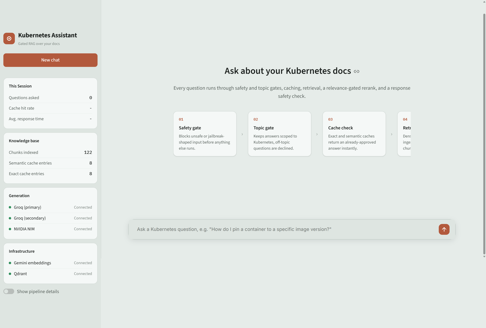
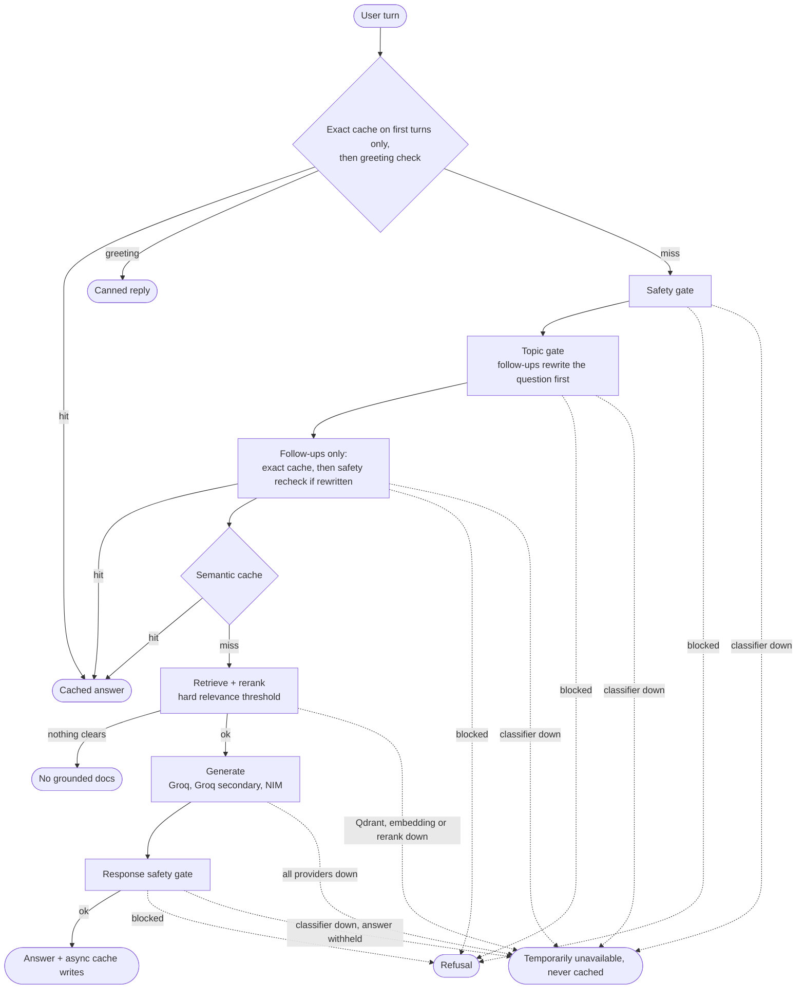

# Kubernetes Gated RAG

A production-oriented RAG system for Kubernetes Q&A that answers only from your own ingested docs, built around defense in depth: versioned two-layer caching, safety and topic gates on both the question and the generated answer, hard relevance thresholds on retrieval, provider failover, and end-to-end tracing.

## Preview
 
<p align="center">
  
  <br>
  <sub>Landing view: Title, description, question box, and the pipeline's own stages rendered inline.</sub>
</p>
> Additional screenshots in [`assets`](assets/).
 
## Architecture
 

```mermaid
flowchart TD
    Start([User turn]) --> Exact{"Exact cache on first turns only,\nthen greeting check"}
    Exact -->|hit| Cached([Cached answer])
    Exact -->|greeting| Hello([Canned reply])
    Exact -->|miss| Safety["Safety gate"]
    Safety --> Topic["Topic gate\nfollow-ups rewrite the question first"]
    Topic --> Recheck["Follow-ups only:\nexact cache, then safety recheck if rewritten"]
    Recheck -->|hit| Cached
    Recheck --> Semantic{"Semantic cache"}
    Semantic -->|hit| Cached
    Semantic -->|miss| Retrieve["Retrieve + rerank\nhard relevance threshold"]
    Retrieve -->|nothing clears| NoDocs([No grounded docs])
    Retrieve -->|ok| Generate["Generate\nGroq, Groq secondary, NIM"]
    Generate --> Check["Response safety gate"]
    Check -->|ok| Answer([Answer + async cache writes])
    Safety -.->|blocked| Refusal([Refusal])
    Topic -.->|blocked| Refusal
    Recheck -.->|blocked| Refusal
    Check -.->|blocked| Refusal
    Safety -.->|classifier down| Unavail(["Temporarily unavailable, never cached"])
    Topic -.->|classifier down| Unavail
    Recheck -.->|classifier down| Unavail
    Retrieve -.->|Qdrant, embedding or rerank down| Unavail
    Generate -.->|all providers down| Unavail
    Check -.->|classifier down, answer withheld| Unavail
```
 
- A first-turn exact-cache hit calls no remote model. A semantic-cache hit still runs both gates and one embedding call.
- Turns with history skip the early cache and are rewritten. If the rewritten question differs from the raw message and misses the exact cache, it gets its own safety check.
- A failed or unusable rewrite (empty, multi-line, oversized) marks the turn degraded: it is answered, but no cache is read or written.
- The UI sends only answered turns as history (no refusals, errors, outages or greetings), capped at `HISTORY_MAX_MESSAGES`.

## Models
 
| Role | Model | Provider | Notes |
|---|---|---|---|
| Generation | `openai/gpt-oss-120b` | Groq -> Groq (secondary account) -> NIM | Same model on every link, separate rate-limit budgets. |
| Planner | `nvidia/nemotron-3-super-120b-a12b` -> `openai/gpt-oss-20b` | NIM -> Groq | Query rewrite, default topic classifier, ingestion relevance, safety fallback. |
| Topic gate (opt-in) | `nvidia/llama-3.1-nemoguard-8b-topic-control` | NIM | Off by default, NVIDIA's endpoint fails recurrently. |
| Safety gate | `nvidia/llama-3.1-nemoguard-8b-content-safety` | NIM | Input and response checks. |
| Embeddings | `gemini-embedding-001` (768 dims) | Gemini | Cache keys, chunks, queries. Cached locally with a TTL. |
| Reranker | `ms-marco-MiniLM-L-12-v2` | FlashRank, local CPU | The only local model. |
| Eval judge | `gemini-3.5-flash` | Gemini | Set via `GEMINI_EVAL_JUDGE_MODEL`. |
 
## Guardrails
 
| Gate | Behavior |
|---|---|
| Input safety | English-only, Unicode-normalized jailbreak patterns block locally. Everything else goes to NeMoGuard, then the planner chain (`GUARDRAIL_SKIP_NEMOGUARD_SAFETY=true` skips NeMoGuard). |
| Topic | Planner-chain classifier. `GUARDRAIL_SKIP_NEMOGUARD_TOPIC=false` enables NeMoGuard. Greetings pass. |
| Relevance | Rerank score must reach `RERANK_SCORE_THRESHOLD`, otherwise "no grounded docs". The prompt restricts the model to the supplied context. |
| Response safety | Checked before display and caching. The answer is withheld if the check cannot run. |
 
## Resilience
 
- **Outages:** A Qdrant, embedding, FlashRank, generation or classifier failure returns "temporarily unavailable". It is never cached and never reported as a policy refusal.
- **Failover:** Generation goes Groq -> Groq secondary -> NIM immediately, with no same-provider retry, on timeouts, rate limits, connection, 5xx, auth, permission and not-found errors, and empty or truncated (`finish_reason=length`) completions. The planner chain is NIM -> Groq.
- **Breakers:** Open after consecutive failures, admit one probe after the recovery window, reopen if it fails. One each for input safety, response safety, topic and every provider link. An open gate breaker falls back to the planner-chain classifier, and the last link of a chain is always tried.
- **Rerank:** Fail-closed. `RERANK_FAIL_CLOSED=false` falls back to retrieval similarity at or above `RERANK_FALLBACK_SCORE_THRESHOLD`.
- **Limits:** Timeouts: generation 15s per provider, planner 4s, NeMoGuard 3s, embeddings 10s, Qdrant 5s. Token caps: generation 2048, planner 512, classifier 512.

## Caching
 
- **Exact:** Local `diskcache`, one host. Keyed by question plus schema, policy and corpus versions. Only whitespace and trailing `?`, `!`, `.` are normalized, so `-l` vs `-L` and `{.items[0]}` stay distinct.
- **Semantic:** Qdrant cosine search at `SEMANTIC_CACHE_SIMILARITY_THRESHOLD`, with the same version filters and whitespace-only normalization.
- **Embeddings:** Local `diskcache` with a TTL. Query and cache-lookup embeddings try once with no rate-limit wait, so a 429 is a cache miss, or "unavailable" on retrieval. Ingestion retries, capped by `EMBEDDING_MAX_RETRY_WAIT_SECONDS`.
- **Writes:** Background, failures logged. No-context answers go to the exact cache only, with a short TTL (`NO_CONTEXT_CACHE_TTL_SECONDS`). Degraded turns never touch the cache.
- **Invalidation:** Each ingest fingerprints the docs collection into `<cache dir>/corpus_version`, which keys include. Bump `CACHE_POLICY_VERSION` or `CACHE_SCHEMA_VERSION` for policy or format changes. `--wipe` drops both Qdrant collections and the exact cache.

## Ingestion
 
```
python ingest.py <data_dir> [--wipe]
```
 
`<data_dir>` holds `true_data/` and/or `noisy_data/`. Both pass the same relevance gate, and `noisy_data/` exists to prove it rejects off-topic content.
 
- **Formats:** `.pdf`, `.docx`, `.pptx`, `.html`, `.htm`, `.txt`, `.md`, `.yaml`, `.yml`. Tables in `.docx` and `.pptx` become `cell | cell` rows.
- **Relevance gate:** An LLM classifies the first 2000 characters. `true_data/` fails open, `noisy_data/` fails closed (`INGEST_CLASSIFIER_TIMEOUT_SECONDS`). Irrelevant or empty files lose their existing points.
- **Chunking:** Markdown splits on `#` headers outside code fences (YAML files skip this). A manifest runs from a top-level `apiVersion:` to the next manifest, `---`, a closing fence or non-YAML text. Prose and manifests over 300 words are windowed with 50 words of overlap, keeping line breaks. Chunks record `section_header`, `manifest_kind` and `manifest_name`.
- **Re-ingest:** Point IDs are deterministic and old points are deleted before upsert, so edits replace rather than duplicate. `source_path` is relative to the data directory, for example `true_data/pods.md`. File failures are logged and skipped. Exit status is 1, with no fingerprint, if the docs collection ends up empty.

## Configuration
 
Copy `.env.example` to `.env` (resolved from the repo root). Every key is required except `LOGFIRE_TOKEN`. Everything else has a default in `src/config.py`. The settings that matter:
 
| Setting | Default | Notes |
|---|---|---|
| `CACHE_POLICY_VERSION` | 2 | Bump when safety, topic or cache policy changes. |
| `CACHE_SCHEMA_VERSION` | 4 | Bump when cache key or payload format changes. |
| `CORPUS_VERSION` | 1 | Used until the first ingest, then `<cache dir>/corpus_version` takes over. |
| `CACHE_DIR` | `.cache` | Resolved from the repo root. Tests use a temp dir. |
| `GUARDRAIL_SKIP_NEMOGUARD_SAFETY` | false | True uses the planner chain for safety. |
| `GUARDRAIL_SKIP_NEMOGUARD_TOPIC` | true | Planner-chain topic gate. False enables NeMoGuard. |
| `RERANK_TOP_K` | 20 | Candidates retrieved from Qdrant. |
| `RERANK_SCORE_THRESHOLD` | 0.5 | Relevance cutoff. Tune on your corpus. |
| `RERANK_FAIL_CLOSED` | true | False falls back to `RERANK_FALLBACK_SCORE_THRESHOLD` (0.6). |
| `SEMANTIC_CACHE_SIMILARITY_THRESHOLD` | 0.95 | Tune on your corpus. |
| `GENERATION_CONTEXT_CHUNKS` | 5 | Chunks sent to generation and shown as sources. |
| `HISTORY_MAX_MESSAGES` | 6 | Chat history passed to the rewrite step. |
| `TRACING_LOG_RAW_MESSAGES` | false | When false, only message length and hash are logged. |
 
## Evaluation
 
`python -m eval.run_eval` scores generation with Ragas: faithfulness, answer relevancy, context precision, context recall, context entity recall, semantic similarity. The judge runs through Gemini's OpenAI-compatible endpoint, with Gemini embeddings for similarity. Results print to stdout and are written to `eval/results.csv`.
 
- **Scope:** Each row of `eval/eval_set.json` brings its own `retrieved_contexts`. Missing answers are generated with `generate_main` and the live prompt, skipping gates, caches, retrieval and rerank.
- **Local run** (8 rows, generation by `openai/gpt-oss-120b` via Groq, judged by `gemini-3.5-flash`, mean per metric):
| Metric | Value |
|---|---|
| `faithfulness` | 0.95 |
| `answer_relevancy` | 0.91 |
| `context_precision` | 1.00 |
| `context_recall` | 0.94 |
| `context_entity_recall` | 0.90 |
| `semantic_similarity` | 0.91 |
 
- **Caveat:** The context metrics score hand-written contexts, not the retriever, and faithfulness is easier than on real retrieval. Eight rows validate the harness and are not a benchmark.

## Project structure
 
```text
kubernetes-gated-rag/
├── .streamlit/config.toml          # Streamlit configuration
├── ui/app.py                       # Streamlit chat UI
│
├── src/
│   ├── config.py                   # environment loading and pipeline configuration
│   ├── graph.py                    # pipeline graph wiring
│   ├── history.py                  # chat history selection for query rewriting
│   ├── tracing.py                  # Logfire tracing
│   │
│   ├── guardrails/
│   │   ├── jailbreak_patterns.py   # deterministic jailbreak detection
│   │   └── gates.py                # safety and topic gates
│   │
│   ├── ingestion/
│   │   ├── chunking.py             # document chunking
│   │   ├── filters.py              # ingestion relevance filtering
│   │   └── parsers.py              # document parsing
│   │
│   ├── providers/
│   │   ├── circuit_breaker.py      # provider failure/recovery handling
│   │   ├── clients.py              # provider clients
│   │   └── llm.py                  # generation, planning, and rewrite calls
│   │
│   └── retrieval/
│       ├── cache.py                # exact and semantic cache operations
│       ├── embeddings.py           # embedding generation and local cache
│       ├── rerank.py               # FlashRank reranking and thresholds
│       └── search.py               # Qdrant retrieval
│
├── eval/
│   ├── dataset.py                  # eval_set.json loader + schema validation
│   ├── eval_set.json               # 8-row starter set
│   └── run_eval.py                 # Ragas scoring harness
│
├── assets/                         # screenshots, icons and static assets
├── tests/                          # unit, graph routing, in-memory Qdrant integration, and UI tests (isolated cache dir, fake credentials)
│
├── ingest.py                       # document ingestion entry point
├── .env.example                    # environment variable template
├── .gitignore                      # keeps .env, caches and local results out of version control
├── pytest.ini                      # pytest configuration
├── requirements.txt                # runtime dependencies
└── README.md
```

## Getting started
 
1. **Keys:** [NVIDIA NIM](https://build.nvidia.com), two [Groq](https://console.groq.com/keys) accounts (separate rate-limit budgets), [Gemini](https://aistudio.google.com/apikey), [Qdrant Cloud](https://cloud.qdrant.io), and optionally [Logfire](https://logfire.pydantic.dev) (tracing no-ops without it).
2. **Install** (Python 3.10 or newer):
   ```
   python3 -m venv venv && source venv/bin/activate
   pip install -r requirements.txt
   cp .env.example .env
   ```
   `ragas==0.4.3` needs `langchain-community<0.4.2`, pinned in `requirements.txt`.
3. **Test and ingest:**
   ```
   pytest
   python ingest.py data --wipe
   ```
   `pytest` runs offline with fake credentials. Omit `--wipe` later to update in place.
4. **Run:**
   ```
   streamlit run ui/app.py
   ```
 
The first launch downloads the FlashRank model from Hugging Face and needs internet. If the download fails, the app starts and retries on the first question, and reranking returns "temporarily unavailable" until it succeeds.
 
The sidebar has New chat, session stats (hit rate counts answered questions only), knowledge-base counts, API key status, and a "Show pipeline details" toggle for the per-turn trace and sources.
 
## Known Limitations
 
- The eval set has 8 rows and does not score the retriever, gates or caches. There is no ablation harness, guardrails are verified only in `tests/test_guardrails.py`.
- Ingested chunks go straight into the generation prompt with no injection filtering. The response safety gate is the only backstop.
- Local jailbreak patterns are English-only regexes. Other attacks rely on the classifiers.
- The exact cache and embedding cache are local to one host.
- Removing a source document requires `--wipe`.
- The test suite uses stubbed providers, an in-memory Qdrant and no real FlashRank model.